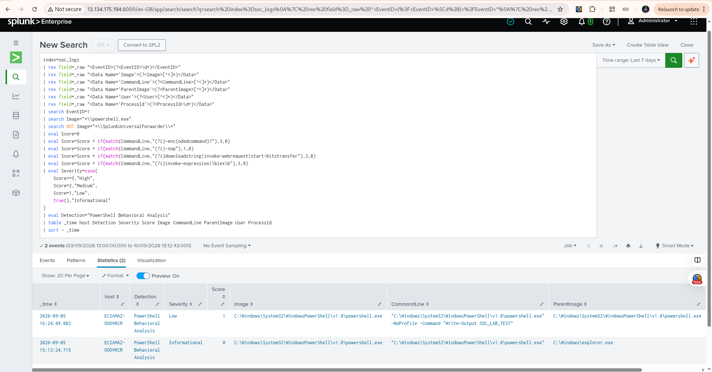

# Detection #1 — PowerShell Behavioral Analysis

## Objective

Detect PowerShell process execution on the Windows SOC lab endpoint and assign a risk score based on potentially suspicious command-line behaviors.

The detection is designed to distinguish ordinary PowerShell activity from PowerShell executions containing higher-risk behaviors.

## Data Source

- **Endpoint:** Windows Server 2025
- **Telemetry:** Sysmon Event ID 1 — Process Creation
- **SIEM:** Splunk Enterprise
- **Index:** `soc_logs`
- **Sourcetype:** `XmlWinEventLog:Microsoft-Windows-Sysmon/Operational`

## Detection Logic

The detection focuses on these command-line indicators:

| Indicator | Score |
|---|---:|
| Encoded PowerShell (`-enc` / `-EncodedCommand`) | +3 |
| NoProfile (`-nop`) | +1 |
| Network retrieval commands | +3 |
| Dynamic code execution (`Invoke-Expression` / `IEX`) | +3 |

### Severity Mapping

| Score | Severity |
|---:|---|
| 0 | Informational |
| 1 | Low |
| 2 | Medium |
| 3+ | High |

The Splunk Universal Forwarder installation directory is excluded to reduce false positives from Splunk's own PowerShell processes.

## SPL Query

```spl
index=soc_logs
| rex field=_raw "<EventID>(?<EventID>\d+)</EventID>"
| rex field=_raw "<Data Name='Image'>(?<Image>[^<]*)</Data>"
| rex field=_raw "<Data Name='CommandLine'>(?<CommandLine>[^<]*)</Data>"
| rex field=_raw "<Data Name='ParentImage'>(?<ParentImage>[^<]*)</Data>"
| rex field=_raw "<Data Name='User'>(?<User>[^<]*)</Data>"
| rex field=_raw "<Data Name='ProcessId'>(?<ProcessId>\d+)</Data>"
| search EventID=1
| search Image="*\\powershell.exe"
| search NOT Image="*\\SplunkUniversalForwarder\\*"
| eval Score=0
| eval Score=Score + if(match(CommandLine,"(?i)-enc(odedcommand)?"),3,0)
| eval Score=Score + if(match(CommandLine,"(?i)-nop"),1,0)
| eval Score=Score + if(match(CommandLine,"(?i)downloadstring|invoke-webrequest|start-bitstransfer"),3,0)
| eval Score=Score + if(match(CommandLine,"(?i)invoke-expression|\biex\b"),3,0)
| eval Severity=case(
    Score>=3,"High",
    Score=2,"Medium",
    Score=1,"Low",
    true(),"Informational"
)
| eval Detection="PowerShell Behavioral Analysis"
| table _time host Detection Severity Score Image CommandLine ParentImage User ProcessId
| sort - _time

## Validation Results

The detection was validated in Splunk using the `soc_logs` index and a seven-day search window.

The search returned **2 PowerShell process creation events**:

* **2026-09-05 16:24:49** — Score **1**, Severity **Low**. PowerShell was executed with `-NoProfile` and a benign test command.
* **2026-09-05 15:13:24** — Score **0**, Severity **Informational**. No suspicious behavioral indicators were detected.

The results confirm that the detection logic successfully identifies PowerShell process creation and assigns severity based on command-line behavior.

### Validation Outcome

The detection is functioning as intended. Benign PowerShell activity can be identified without automatically classifying it as malicious, while commands containing suspicious behaviors such as encoded commands, network retrieval, or dynamic code execution receive higher scores.

No High-severity PowerShell activity was observed during the validation period.

## Conclusion

Detection 01 successfully demonstrates basic PowerShell behavioral detection and risk scoring in Splunk. The rule can be used as a foundation for future detection engineering and can be further improved with additional behavioral indicators and false-positive tuning.

## Evidence


