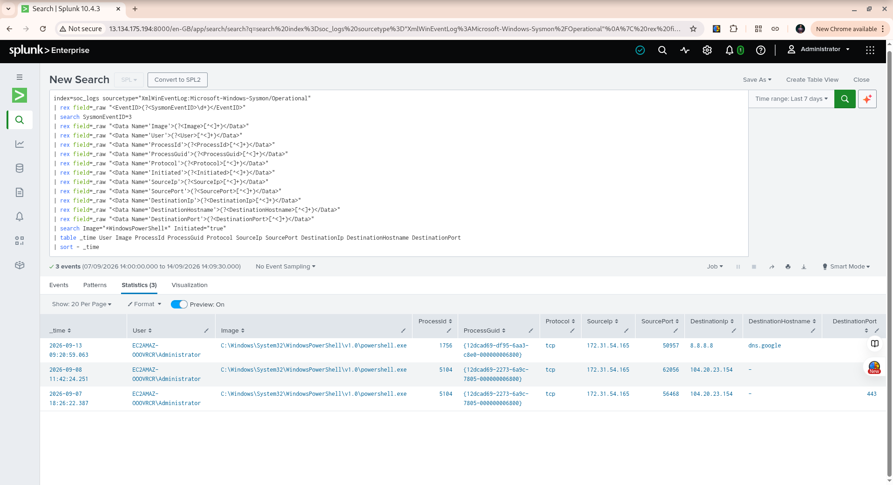

# Detection 04 — PowerShell External Network Activity: Analyst Triage

## Objective

Identify outbound network connections initiated by Windows PowerShell and provide additional process and network context for SOC analyst investigation.

This detection is designed for **analyst triage**. A match does not automatically indicate malicious activity.

## Data Source

* **Platform:** Windows Server 2025
* **Telemetry:** Sysmon
* **Sysmon Event ID:** 3 — Network Connection
* **Splunk Index:** `soc_logs`
* **Sourcetype:** `XmlWinEventLog:Microsoft-Windows-Sysmon/Operational`

## Detection Logic

The detection:

1. Searches Sysmon Event ID 3 network connection events.
2. Extracts relevant values from the raw XML using `rex`.
3. Identifies Windows PowerShell network activity.
4. Requires `Initiated=true` to focus on connections initiated by the process.
5. Displays user, process, network, and destination information.
6. Sorts the newest activity first.

## SPL Query

```spl
index=soc_logs sourcetype="XmlWinEventLog:Microsoft-Windows-Sysmon/Operational"
| rex field=_raw "<EventID>(?<SysmonEventID>\d+)</EventID>"
| search SysmonEventID=3
| rex field=_raw "<Data Name='Image'>(?<Image>[^<]+)</Data>"
| rex field=_raw "<Data Name='User'>(?<User>[^<]+)</Data>"
| rex field=_raw "<Data Name='ProcessId'>(?<ProcessId>[^<]+)</Data>"
| rex field=_raw "<Data Name='ProcessGuid'>(?<ProcessGuid>[^<]+)</Data>"
| rex field=_raw "<Data Name='Protocol'>(?<Protocol>[^<]+)</Data>"
| rex field=_raw "<Data Name='Initiated'>(?<Initiated>[^<]+)</Data>"
| rex field=_raw "<Data Name='SourceIp'>(?<SourceIp>[^<]+)</Data>"
| rex field=_raw "<Data Name='SourcePort'>(?<SourcePort>[^<]+)</Data>"
| rex field=_raw "<Data Name='DestinationIp'>(?<DestinationIp>[^<]+)</Data>"
| rex field=_raw "<Data Name='DestinationHostname'>(?<DestinationHostname>[^<]+)</Data>"
| rex field=_raw "<Data Name='DestinationPort'>(?<DestinationPort>[^<]+)</Data>"
| search Image="*WindowsPowerShell*" Initiated="true"
| table _time User Image ProcessId ProcessGuid Protocol SourceIp SourcePort DestinationIp DestinationHostname DestinationPort
| sort - _time
```

## Why `rex` Is Used

The Sysmon events are stored as XML in the `_raw` field.

For example, the event contains values such as:

```xml
<Data Name='Image'>C:\Windows\System32\WindowsPowerShell\v1.0\powershell.exe</Data>
```

Splunk can receive the XML, but for this investigation we need individual values such as `Image`, `User`, `ProcessGuid`, and `DestinationIp`.

The `rex` commands extract those values from the XML so that Splunk can search, filter, and display them.

## Validation Results

The query returned **3 events** during the seven-day search period.

### Event 1

* Time: `2026-09-13 09:20:59.063`
* User: `EC2AMAZ-OOOVRCR\Administrator`
* Process: `powershell.exe`
* Process ID: `1756`
* Protocol: `tcp`
* Source IP: `172.31.54.165`
* Source Port: `50957`
* Destination IP: `8.8.8.8`
* Destination Hostname: `dns.google`
* Destination Port: `443`
* Initiated: `true`

### Event 2

* Time: `2026-09-08 11:42:24.251`
* User: `EC2AMAZ-OOOVRCR\Administrator`
* Process: `powershell.exe`
* Process ID: `5104`
* Process GUID: `{12dcad69-2273-6a9c-7805-000000006800}`
* Protocol: `tcp`
* Source IP: `172.31.54.165`
* Source Port: `62056`
* Destination IP: `104.20.23.154`
* Destination Port: `443`
* Initiated: `true`

### Event 3

* Time: `2026-09-07 18:26:22.387`
* User: `EC2AMAZ-OOOVRCR\Administrator`
* Process: `powershell.exe`
* Process ID: `5104`
* Protocol: `tcp`
* Source IP: `172.31.54.165`
* Destination IP: `104.20.23.154`
* Destination Port: `443`
* Initiated: `true`

## Analyst Interpretation

The three events demonstrate that Windows PowerShell initiated outbound TCP connections to external destinations over port 443.

Two events were associated with `104.20.23.154`, while one event connected to `8.8.8.8` with the hostname `dns.google`.

The available evidence does **not** establish that these connections were malicious.

Therefore, this detection should be treated as an **investigation/triage signal**, not a confirmed security incident.

## Investigation Workflow

When this detection produces an alert, an analyst should investigate:

1. **User context**

   * Who was using the system?
   * Was PowerShell activity expected?

2. **Process context**

   * Review the Process ID.
   * Use the Process GUID when correlating Sysmon events.
   * Look for a corresponding Sysmon Event ID 1 process-creation event.

3. **Command-line context**

   * Determine what PowerShell command or script was executed.
   * Look for suspicious parameters or unexpected scripts.

4. **Destination context**

   * Identify the destination IP and hostname.
   * Determine whether the destination is expected for the environment.
   * Perform appropriate reputation and ownership checks when investigating a real alert.

5. **Timeline**

   * Review events immediately before and after the network connection.
   * Look for additional process, network, authentication, or file activity.

## Telemetry Limitation Observed During Validation

During investigation, the Process GUID associated with the September 7 and September 8 network events did not have a corresponding Event ID 1 process-creation record in the available dataset.

Therefore, the PowerShell command line responsible for those two network connections could not be reliably established from the available telemetry.

This demonstrates an important SOC principle:

> Do not assume missing telemetry. Record what the evidence actually shows.

## Detection Strength

**Severity:** Medium — Analyst Triage

The detection is useful because PowerShell is a legitimate Windows administration tool but can also be used by attackers for a variety of activities.

The detection should therefore generate an investigation opportunity rather than automatically classify the activity as malicious.

## False Positive Considerations

Potential legitimate causes include:

* System administration
* Administrative scripts
* Software installation or updates
* Connectivity testing
* DNS or network troubleshooting
* Other authorized PowerShell automation

## Detection 04 Status

**Status:** Validated

**Validation result:** 3 matching events

**Primary telemetry:** Sysmon Event ID 3

**Detection purpose:** PowerShell outbound network activity with investigation context

**Conclusion:** The SPL query successfully identifies and enriches PowerShell-initiated network connections for SOC analyst triage.

## Validation Evidence

The detection was validated in Splunk against the Windows Server endpoint.

The search returned three PowerShell network connection events. The screenshot below shows the actual Splunk results used during validation.


### Observed Results

The validation returned three events involving the Windows PowerShell executable:

- `C:\Windows\System32\WindowsPowerShell\v1.0\powershell.exe`
- User: `EC2AMAZ-OOOVRCR\Administrator`
- Destination `8.8.8.8` over TCP/443
- Destination `104.20.23.154` over TCP/443
- Events were generated by Sysmon Event ID 3.

These results demonstrate that the detection is successfully identifying external network activity originating from Windows PowerShell.

The events were treated as **analyst-triage candidates**, not automatically classified as malicious. Additional investigation would be required before determining whether the activity represents legitimate administration or suspicious behavior.
