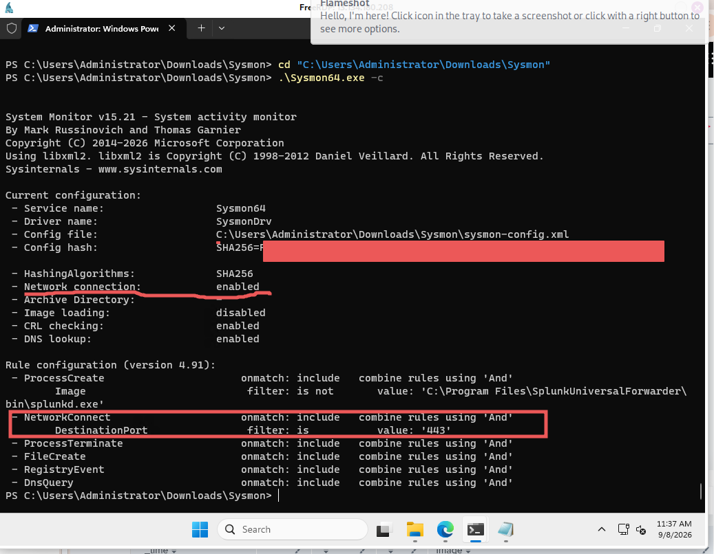
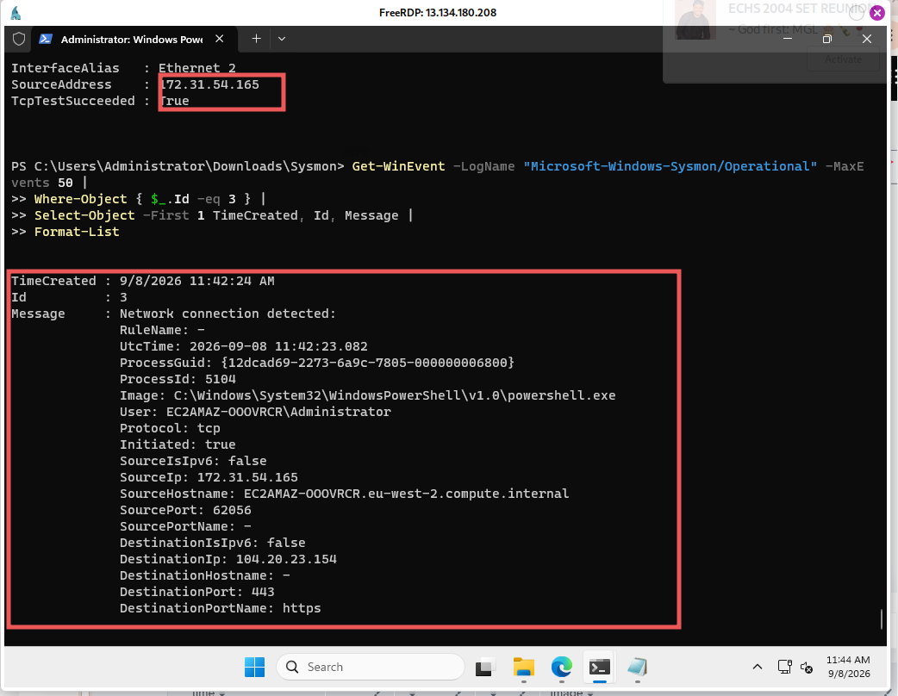
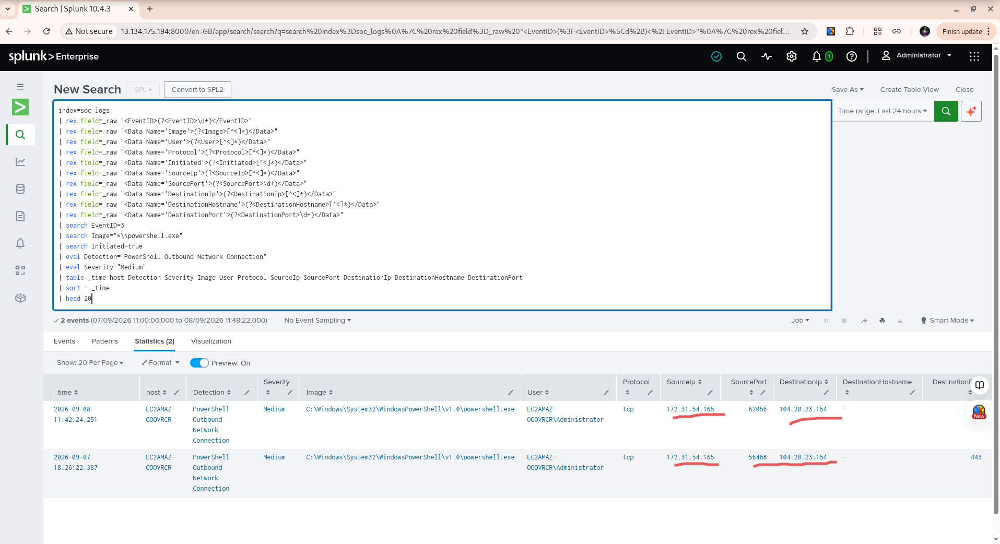
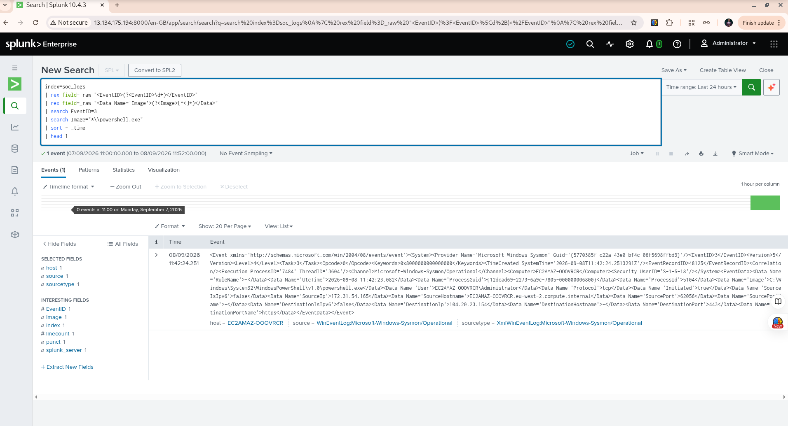

# Detection 02 — PowerShell Outbound Network Connection

## 1. Overview

This detection identifies outbound network connections initiated by
PowerShell on the Windows SOC lab endpoint.

The detection uses **Sysmon Event ID 3 (Network Connection)** collected
by the Splunk Universal Forwarder and forwarded to Splunk Enterprise
over TCP port 9997.

The purpose of this detection is to identify PowerShell network activity
that may require investigation.

> **Important:** A PowerShell network connection is not automatically
> malicious. PowerShell is a legitimate Windows administration tool, so
> additional context is required before classifying an event as
> suspicious.

## 2. Lab Architecture

Windows Server 2025

\|

\| Sysmon Event ID 3

v

Splunk Universal Forwarder

\|

\| TCP 9997

v

Splunk Enterprise

\|

\| SPL Detection

v

PowerShell Outbound Network Connection

## 3. Objective

The objective of this detection is to identify PowerShell processes that
initiate outbound network connections.

PowerShell network activity can be legitimate, but it can also be useful
during security investigations when combined with suspicious
command-line activity, unusual parent processes, unexpected users, or
unusual network destinations.

# 4. Sysmon Configuration

Sysmon was configured to collect network connections to destination port
443.

The relevant configuration is:

\<NetworkConnect onmatch="include"\>

\<DestinationPort\>443\</DestinationPort\>

\</NetworkConnect\>

This configuration allows the lab to collect HTTPS-related network
connection events generated by processes on the Windows endpoint.

###  SCREENSHOT 1 — Sysmon Configuration

**Recommended screenshot filename:**

detection-02-sysmon-network-config.png

The screenshot should show the Sysmon configuration verification and,
preferably:

- NetworkConnect onmatch: include

- DestinationPort filter: 443

- The active Sysmon configuration

Do not include passwords, private keys, or other credentials.

# 5. Windows Endpoint Validation

A controlled and harmless PowerShell network connection was generated on
the Windows SOC lab endpoint.

Sysmon generated **Event ID 3**, which records network connection
information.

The event contains useful investigation fields including:

- Process image

- User

- Protocol

- Source IP

- Source port

- Destination IP

- Destination port

- Initiated status

###  SCREENSHOT 2 — Windows Sysmon Event ID 3

**Recommended screenshot filename:**

detection-02-windows-sysmon-event3.png

The screenshot should clearly show:

Id: 3

Image: powershell.exe

User: Administrator

Protocol: tcp

Initiated: true

DestinationPort: 443

This provides evidence that the Windows endpoint actually generated the
telemetry.

# 6. Splunk Data Collection

The Sysmon event was forwarded from the Windows endpoint to Splunk using
the Splunk Universal Forwarder.

The event was received in the dedicated:

soc_logs

index.

The data flow was:

Windows Sysmon

↓

Event ID 3

↓

Universal Forwarder

↓

TCP 9997

↓

Splunk Enterprise

↓

soc_logs

This confirms that the endpoint telemetry is successfully reaching the
SIEM.

# 7. Detection Query

The following SPL query extracts the relevant fields from the Sysmon XML
and identifies PowerShell outbound network connections.

index=soc_logs

\| rex field=\_raw "\<EventID\>(?\<EventID\>\d+)\</EventID\>"

\| rex field=\_raw "\<Data Name='Image'\>(?\<Image\>\[^\<\]\*)\</Data\>"

\| rex field=\_raw "\<Data Name='User'\>(?\<User\>\[^\<\]\*)\</Data\>"

\| rex field=\_raw "\<Data
Name='Protocol'\>(?\<Protocol\>\[^\<\]\*)\</Data\>"

\| rex field=\_raw "\<Data
Name='Initiated'\>(?\<Initiated\>\[^\<\]\*)\</Data\>"

\| rex field=\_raw "\<Data
Name='SourceIp'\>(?\<SourceIp\>\[^\<\]\*)\</Data\>"

\| rex field=\_raw "\<Data
Name='SourcePort'\>(?\<SourcePort\>\d+)\</Data\>"

\| rex field=\_raw "\<Data
Name='DestinationIp'\>(?\<DestinationIp\>\[^\<\]\*)\</Data\>"

\| rex field=\_raw "\<Data
Name='DestinationHostname'\>(?\<DestinationHostname\>\[^\<\]\*)\</Data\>"

\| rex field=\_raw "\<Data
Name='DestinationPort'\>(?\<DestinationPort\>\d+)\</Data\>"

\| search EventID=3

\| search Image="\*\\powershell.exe"

\| search Initiated=true

\| eval Detection="PowerShell Outbound Network Connection"

\| eval Severity="Medium"

\| table \_time host Detection Severity Image User Protocol SourceIp
SourcePort DestinationIp DestinationHostname DestinationPort

\| sort - \_time

# 8. Splunk Detection Result

The detection was executed in Splunk against the soc_logs index.

The search returned:

Complete: 1 event

The detected event contained the following information:

| Field | Observed Value |
|----|----|
| Event ID | 3 |
| Detection | PowerShell Outbound Network Connection |
| Severity | Medium |
| Image | C:\Windows\System32\WindowsPowerShell\v1.0\powershell.exe |
| User | EC2AMAZ-OOOVRCR\Administrator |
| Protocol | TCP |
| Initiated | true |
| Source IP | 172.31.54.165 |
| Source Port | 56468 |
| Destination IP | 104.20.23.154 |
| Destination Port | 443 |

###  SCREENSHOT 3 — Splunk Detection Result

**Recommended screenshot filename:**

detection-02-splunk-result.png

This should be the main evidence screenshot.

Try to capture the Splunk Statistics/Results table showing:

Detection

Severity

Image

User

Protocol

SourceIp

SourcePort

DestinationIp

DestinationPort

# 9. Raw Sysmon Event in Splunk

The detected event was also inspected in its raw XML form.

The raw event contains the original Sysmon telemetry, including Event ID
3 and the network connection details.

###  SCREENSHOT 4 — Splunk Raw Event

**Insert screenshot here:**

**Recommended screenshot filename:**

detection-02-splunk-raw-event.png

The screenshot should preferably show:

\<EventID\>3\</EventID\>

and fields such as:

Image

User

Protocol

Initiated

SourceIp

DestinationIp

DestinationPort

This demonstrates that the detection is based on actual endpoint
telemetry received by Splunk.

# 10. Detection Logic

The detection performs the following operations:

1.  Searches the soc_logs index.

2.  Extracts the Sysmon Event ID.

3.  Extracts the process image.

4.  Extracts the user.

5.  Extracts network information.

6.  Filters for Sysmon Event ID 3.

7.  Filters for PowerShell.

8.  Requires Initiated=true.

9.  Labels the event as PowerShell Outbound Network Connection.

10. Assigns an initial severity of Medium.

11. Displays the fields required for investigation.

# 11. Why the Severity Is Medium

The detection is assigned **Medium** severity because PowerShell making
an outbound HTTPS connection is not necessarily malicious.

Legitimate examples include:

- System administration

- Automation

- Software management

- Security tools

- Windows management activities

However, PowerShell network activity becomes more interesting when it
occurs together with other suspicious indicators.

Examples include:

- Encoded PowerShell commands

- Suspicious command-line arguments

- Unexpected parent processes

- Unusual user accounts

- Unusual destinations

- Multiple unexpected connections

- Other suspicious Sysmon events

Therefore, this detection should be treated as an **investigation
signal**, rather than an automatic malicious verdict.

# 12. False Positive Considerations

Potential false positives include:

- System administrators using PowerShell

- Legitimate automation scripts

- Software installation scripts

- Windows management operations

- Security and monitoring tools

An analyst should investigate the surrounding context before escalating
the event.

# 13. Investigation Workflow

When this detection fires, a SOC analyst should investigate the
following:

### Step 1 — Identify the PowerShell process

Determine which PowerShell executable initiated the connection.

### Step 2 — Examine the command line

Determine what PowerShell was executing.

### Step 3 — Examine the parent process

Determine which process launched PowerShell.

### Step 4 — Identify the user

Determine whether the user account is expected to perform the activity.

### Step 5 — Investigate the destination

Determine whether the destination IP or hostname is expected.

### Step 6 — Examine timing

Look for other events occurring immediately before or after the network
connection.

### Step 7 — Correlate telemetry

Correlate the event with:

- Sysmon Event ID 1 — Process Creation

- Sysmon Event ID 3 — Network Connection

- Sysmon Event ID 11 — File Creation

- Sysmon Registry events

- Sysmon Event ID 22 — DNS Query

- Authentication events

- Other endpoint telemetry

# 14. MITRE ATT&CK Relevance

This detection supports investigation of:

**T1059.001 — Command and Scripting Interpreter: PowerShell**

The detection does not by itself establish malicious PowerShell
activity.

Additional telemetry and investigation are required to determine whether
the PowerShell process was being used legitimately or as part of
suspicious activity.

# 15. Validation Summary

The detection was successfully validated in the SOC lab.

The complete telemetry path was:

PowerShell

↓

Sysmon Event ID 3

↓

Splunk Universal Forwarder

↓

TCP 9997

↓

Splunk Enterprise

↓

soc_logs

↓

SPL field extraction

↓

Detection

The final Splunk search returned **1 PowerShell outbound network
connection**.

The event showed:

Process: powershell.exe

Protocol: TCP

Initiated: true

Destination: 104.20.23.154

Port: 443

Severity: Medium

# 16. Evidence

The following screenshots should be included with this detection:

| Screenshot | Purpose | Filename |
|----|----|----|
| 1 | Sysmon network configuration | detection-02-sysmon-network-config.png |
| 2 | Windows Sysmon Event ID 3 | detection-02-windows-sysmon-event3.png |
| 3 | Splunk detection result | detection-02-splunk-result.png |
| 4 | Splunk raw event | detection-02-splunk-raw-event.png |

# 17. Lessons Learned

This detection provided several practical SOC lessons:

- Sysmon Event ID 3 provides visibility into process-to-network
  activity.

- Endpoint telemetry must successfully travel through the collection
  pipeline before a SIEM detection can work.

- Raw Sysmon XML may require custom field extraction in Splunk.

- PowerShell network activity should not automatically be classified as
  malicious.

- Behavioral detections become stronger when multiple telemetry sources
  are correlated.

- Controlled lab validation provides evidence that a detection actually
  works.

- Screenshots provide useful visual evidence for a cybersecurity
  portfolio.

# 18. Status

**Detection \#2 — PowerShell Outbound Network Connection**

**Status:** Complete and validated

**Endpoint:** Windows Server 2025

**Telemetry:** Sysmon

**Event ID:** 3

**Collector:** Splunk Universal Forwarder

**SIEM:** Splunk Enterprise

**Index:** soc_logs

**Detection Severity:** Medium

**Validation:** Successful
