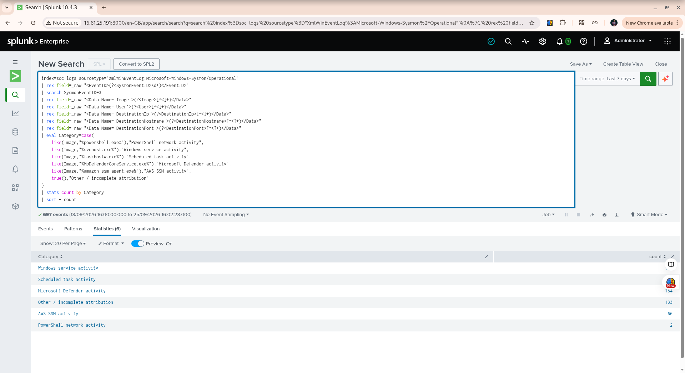

# Week 10 Exercise 05 — Alert Prioritization

## Objective

The objective of this exercise was to practice prioritizing SOC network alerts using existing Windows Sysmon telemetry.

The exercise focused on distinguishing between:

* High-volume but recognizable system activity
* Known and previously validated PowerShell network activity
* Network activity with incomplete process attribution

The exercise was performed using existing lab telemetry only. No new suspicious activity was intentionally generated.

---

## Detection Context

The investigation used Sysmon Event ID 3 network connection telemetry collected from the Windows Server endpoint and forwarded to Splunk.

The primary Splunk data source was:

```text
index=soc_logs
sourcetype=XmlWinEventLog:Microsoft-Windows-Sysmon/Operational
```

The investigation covered the available telemetry from:

```text
18/09/2026 15:00:00
to
25/09/2026 15:54:54
```

---

## Step 1 — Network Activity Baseline

The initial analysis grouped Event ID 3 network connections by process image, user, and destination port.

The query returned 691 network events and identified 28 process/user combinations.

The highest-volume activity included:

| Process / Activity        | User   | Port | Events |
| ------------------------- | ------ | ---: | -----: |
| svchost.exe               | SYSTEM |  443 |    159 |
| MpDefenderCoreService.exe | SYSTEM |  443 |    146 |
| taskhostw.exe             | SYSTEM |  443 |    144 |
| Unknown process           | -      |  443 |     67 |
| amazon-ssm-agent.exe      | SYSTEM |  443 |     66 |

This demonstrated that network-event volume alone is not sufficient to determine analyst priority.

---

## Step 2 — Category-Based Prioritization

The network events were grouped into recognizable categories.

The resulting 693 events were classified as follows:

| Category                       | Events |
| ------------------------------ | -----: |
| Windows service activity       |    181 |
| Scheduled task activity        |    160 |
| Microsoft Defender activity    |    151 |
| Other / incomplete attribution |    133 |
| AWS SSM activity               |     66 |
| PowerShell network activity    |      2 |

The slight difference from the earlier 691-event baseline resulted from additional telemetry becoming available during the investigation.

### Analyst Observation

High-volume activity was primarily associated with recognizable Windows, Microsoft Defender, and AWS system processes.

The PowerShell category contained only two events and had already been investigated as controlled lab activity.

The "Other / incomplete attribution" category required additional review because some events lacked clear process attribution.

---

## Step 3 — Investigation of Incomplete Attribution

The "Other / incomplete attribution" category contained 133 events.

The results included identifiable applications such as:

* `backgroundTaskHost.exe`
* `MoUsoCoreWorker.exe`
* `msedgewebview2.exe`

It also contained events displayed as:

```text
<unknown process>
```

Several unknown-process connections used TCP port 443.

Examples included connections to:

```text
40.84.85.40:443
48.211.4.16:443
57.154.63.210:443
172.215.188.225:443
20.42.179.192:443
```

The presence of an unknown process was treated as an attribution gap rather than evidence of malicious activity.

---

## Step 4 — Destination Correlation

The destination:

```text
20.42.179.192
```

was selected for additional investigation because it appeared in both attributed and unattributed network events.

The investigation returned 20 events.

Three examples contained incomplete attribution:

| Time                    | User | Image               |  PID | ProcessGuid |
| ----------------------- | ---- | ------------------- | ---: | ----------- |
| 2026-09-21 11:22:29.742 | -    | `<unknown process>` | 1656 | All zeros   |
| 2026-09-21 15:05:53.383 | -    | `<unknown process>` | 1400 | All zeros   |
| 2026-09-21 19:13:38.460 | -    | `<unknown process>` | 6048 | All zeros   |

Other events to the same destination were associated with identifiable Windows processes, including:

```text
taskhostw.exe
svchost.exe
```

with valid ProcessGuids.

---

## Step 5 — PID and ProcessGuid Analysis

One particularly useful example occurred at:

```text
2026-09-21 19:13:38.460
```

The network event contained:

```text
PID: 6048
ProcessGuid: {00000000-0000-0000-0000-000000000000}
Image: <unknown process>
```

Approximately 0.256 seconds later, another network event appeared with:

```text
PID: 6048
ProcessGuid: {12dcad69-81df-6ab1-8b12-000000006a00}
Image: C:\Windows\System32\taskhostw.exe
```

The matching PID alone was not considered sufficient evidence to attribute the first event to `taskhostw.exe`.

The ProcessGuid values were different, demonstrating why SOC analysts should avoid relying on PID alone when correlating process and network telemetry.

This finding is consistent with previous Week 8 and Week 9 investigations involving PID reuse and incomplete Sysmon attribution.

---

## Step 6 — Known PowerShell Activity

The PowerShell network detection produced two events during the historical investigation period.

Both events involved:

```text
powershell.exe
Administrator
8.8.8.8
dns.google
TCP/443
```

The activity was generated by controlled lab testing using:

```powershell
Test-NetConnection 8.8.8.8 -Port 443
```

The activity had already been investigated during previous exercises and was determined to be expected lab activity.

Therefore, the PowerShell events were not treated as an active malicious incident.

---

## Prioritization Criteria

The following evidence-based criteria were used:

### Routine / Monitoring

Characteristics:

* Recognizable system process
* Expected Windows, Defender, or AWS role
* Strong process attribution
* Repeated normal-looking system activity
* No additional suspicious indicators identified

Examples:

```text
svchost.exe
taskhostw.exe
MpDefenderCoreService.exe
amazon-ssm-agent.exe
```

### Additional Analyst Review

Characteristics:

* Incomplete process attribution
* Unknown process information
* All-zero ProcessGuid
* Insufficient evidence to establish process ownership
* Destination or behavior requires additional context

This category does not automatically indicate malicious activity.

### Previously Validated / Controlled

Characteristics:

* Known lab-generated activity
* Known process
* Known test action
* Previously investigated and documented

Example:

```text
PowerShell → 8.8.8.8:443
```

generated using controlled `Test-NetConnection` activity.

---

## Analyst Assessment

The investigation demonstrated that alert priority should not be determined solely by event volume.

The highest-volume network activity was primarily associated with recognizable Windows, security, and AWS processes.

The two PowerShell network events were low volume but initially important enough to investigate because PowerShell-initiated network connections can require analyst validation. After investigation, the activity was confirmed as controlled lab testing.

The unknown-process events received additional analyst attention because their process ownership could not be confidently established from the available telemetry.

However, no evidence collected during this exercise established that these events represented malicious activity.

---

## Final Disposition

| Activity                         | Disposition                       | Reason                                                           |
| -------------------------------- | --------------------------------- | ---------------------------------------------------------------- |
| Windows service activity         | Routine / Monitor                 | High volume with recognizable system processes                   |
| Scheduled task activity          | Review / Contextualize            | Recognizable Windows activity with available process attribution |
| Microsoft Defender activity      | Routine / Monitor                 | Security software activity                                       |
| AWS SSM activity                 | Routine / Monitor                 | Recognizable AWS management activity                             |
| PowerShell network activity      | Validated benign lab activity     | Confirmed controlled testing                                     |
| Unknown-process network activity | Additional investigation required | Process attribution incomplete                                   |

---

## Key SOC Analyst Lessons

### 1. Volume is not priority

A large number of events does not automatically make an activity suspicious.

### 2. Attribution matters

A recognizable process with a clear system role provides more context than an event where the originating process is unknown.

### 3. PID alone is not enough

Process IDs can be reused. ProcessGuid provides stronger correlation when available.

### 4. Unknown does not mean malicious

An unknown process represents an evidence gap. The analyst should investigate the gap rather than immediately declaring the activity malicious.

### 5. Context changes priority

The same destination can appear in both attributed and unattributed events. Destination information must therefore be evaluated together with process, user, timing, and other available telemetry.

---

## Exercise Outcome

This exercise demonstrated practical SOC alert-prioritization skills using real telemetry from the lab.

The investigation compared high-volume routine activity, controlled PowerShell network activity, and incomplete process attribution.

The final assessment was based on available evidence and avoided treating unusual or incomplete telemetry as automatically malicious.

This exercise strengthened the ability to:

* Establish a network-event baseline
* Group alerts by process context
* Identify incomplete attribution
* Correlate network activity with process identifiers
* Distinguish volume from investigative priority
* Apply evidence-based triage
* Document analyst reasoning and disposition

## Validation Evidence

The following Splunk screenshot shows the category-based network activity analysis used to support alert prioritization.


