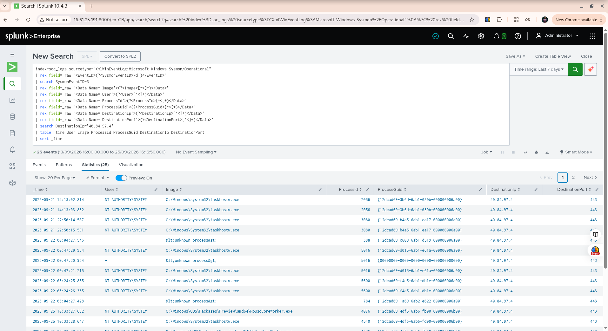

# Week 10 Exercise 06 — Multi-Event Investigation

## Objective

The objective of this exercise was to investigate a known PowerShell process using multiple Sysmon event IDs and surrounding endpoint telemetry.

The investigation focused on reconstructing the activity surrounding the PowerShell process, identifying its parent process, checking for network, file, and registry activity, and determining whether related network activity could be attributed to the PowerShell process.

The investigation used existing SOC lab telemetry only. No new suspicious activity was generated.

---

## Target Process

**Process:** `powershell.exe`

**Time:** `2026-09-25 10:41:58.453`

**User:** `NT AUTHORITY\SYSTEM`

**Process ID:** `5524`

**ProcessGuid:**

`{12dcad69-4ff6-6ab6-ac01-000000006b00}`

**Parent Process:**

`C:\Windows\System32\CompatTelRunner.exe`

**Parent Process ID:** `6692`

**Parent ProcessGuid:**

`{12dcad69-4feb-6ab6-a701-000000006b00}`

**CommandLine:**

```text
powershell.exe -ExecutionPolicy Restricted -Command $res = 0; if(get-vmswitch | Where {$_.NetAdapterInterfaceDescription -ne $null -and $_.NetAdapterInterfaceDescription -eq (Get-NetLbfoTeamNic).InterfaceDescription}){$res=1}; Write-Host "Final result:", $res
```

The command checks Windows networking configuration using `Get-VMSwitch` and `Get-NetLbfoTeamNic`.

---

## Event ID Correlation

The exact PowerShell ProcessGuid was searched across several Sysmon event types.

| Sysmon Event ID                        | Result |
| -------------------------------------- | -----: |
| Event ID 1 — Process Creation          |      1 |
| Event ID 3 — Network Connection        |      0 |
| Event ID 11 — File Creation            |      0 |
| Event IDs 12/13/14 — Registry Activity |      0 |

The results indicate that no additional Event ID 3, 11, 12, 13, or 14 activity was attributed to the exact PowerShell ProcessGuid in the available telemetry.

This does not prove that the process performed no other activity. It means that no corresponding telemetry for those specific event types was observed for the exact ProcessGuid.

---

## Process Tree

The surrounding process relationships reconstructed from Sysmon telemetry were:

```text
wininit.exe
    |
    └── services.exe
          |
          └── svchost.exe
                |
                └── CompatTelRunner.exe
                      |
                      └── powershell.exe
                            |
                            └── conhost.exe
```

The immediate parent of the target PowerShell process was `CompatTelRunner.exe`.

The parent `CompatTelRunner.exe` was itself launched by:

`svchost.exe -k InvSvcGroup -p -s InventorySvc`

This process chain is consistent with Windows system and telemetry-related activity.

---

## Surrounding Timeline

A 35-second investigation window around the target process identified the following relevant events:

| Time         | Event ID | Process               | Activity                                    |
| ------------ | -------: | --------------------- | ------------------------------------------- |
| 10:41:44.232 |        3 | `svchost.exe`         | Network connection                          |
| 10:41:47.672 |        1 | `CompatTelRunner.exe` | Process creation                            |
| 10:41:49.556 |        3 | `CompatTelRunner.exe` | Network → `40.84.97.4:443`                  |
| 10:41:55.344 |        1 | `PowerShell.exe`      | Windows configuration check                 |
| 10:41:55.351 |        1 | `conhost.exe`         | Child of PowerShell                         |
| 10:41:58.081 |        1 | `PowerShell.exe`      | `Write-Host 'Final result: 1'`              |
| 10:41:58.087 |        1 | `conhost.exe`         | Child of PowerShell                         |
| 10:41:58.453 |        1 | `PowerShell.exe`      | `Get-VMSwitch` / `Get-NetLbfoTeamNic` check |
| 10:41:58.459 |        1 | `conhost.exe`         | Child of PowerShell                         |
| 10:42:08.952 |        1 | `CompatTelRunner.exe` | `invagent.dll` activity                     |
| 10:42:09.120 |        1 | `CompatTelRunner.exe` | `aemarebackup.dll` activity                 |

This showed that multiple PowerShell processes were launched by `CompatTelRunner.exe` within the same short period.

---

## Parent Network Activity

The parent `CompatTelRunner.exe` process was investigated separately using its ProcessGuid:

`{12dcad69-4feb-6ab6-a701-000000006b00}`

One Event ID 3 record was identified:

```text
Time:              2026-09-25 10:41:49.556
Process:           C:\Windows\system32\compattelrunner.exe
PID:               6692
Protocol:          tcp
Destination IP:    40.84.97.4
Destination Port:  443
User:              NT AUTHORITY\SYSTEM
```

This network connection occurred approximately nine seconds before the target PowerShell process was created.

The connection was attributed to `CompatTelRunner.exe`, not to the target PowerShell ProcessGuid.

---

## Destination Investigation

The destination `40.84.97.4:443` was searched across the available Event ID 3 telemetry.

A total of **25 events** were identified.

The destination was contacted by multiple Windows SYSTEM processes, including:

* `taskhostw.exe`
* `MoUsoCoreWorker.exe`
* `svchost.exe`
* `CompatTelRunner.exe`
* Several events recorded as `<unknown process>`

The chronological investigation showed that connections to `40.84.97.4:443` occurred on multiple dates, including September 21, September 22, and September 25.

For example:

```text
2026-09-21 14:13:02.814  taskhostw.exe
2026-09-21 22:50:14.587  taskhostw.exe
2026-09-22 00:04:27.546  <unknown process>
2026-09-22 00:47:20.964  taskhostw.exe
2026-09-25 10:33:27.632  MoUsoCoreWorker.exe
2026-09-25 10:33:28.647  taskhostw.exe
2026-09-25 10:41:49.556  CompatTelRunner.exe
```

This demonstrates that the destination was not unique to the investigated `CompatTelRunner.exe` process.

---

## Key Finding

The investigation established an important distinction between **process association** and **temporal correlation**.

`CompatTelRunner.exe` communicated with `40.84.97.4:443` shortly before launching the target PowerShell process.

However, the target PowerShell ProcessGuid itself had **no Event ID 3 network connection**.

Therefore, the available telemetry does not support attributing the network connection to the PowerShell process.

The destination also appeared in network activity from several other Windows SYSTEM processes across multiple days.

---

## Analyst Assessment

The available evidence is consistent with expected Windows system and telemetry-related activity.

The target PowerShell process:

* Ran as `NT AUTHORITY\SYSTEM`.
* Used `-ExecutionPolicy Restricted`.
* Was launched by `CompatTelRunner.exe`.
* Performed a Windows networking configuration check.
* Had no Event ID 3 network activity attributed to its exact ProcessGuid.
* Had no Event ID 11 file creation activity attributed to its exact ProcessGuid.
* Had no Event ID 12/13/14 registry activity attributed to its exact ProcessGuid.

No malicious indicators were identified in the available telemetry for this specific process investigation.

The conclusion is scoped to the telemetry collected by the SOC lab and does not establish that the destination IP or every related Windows process is inherently benign.

---

## Limitations

The investigation is limited by the available Sysmon telemetry.

In particular:

* Absence of an Event ID does not prove that an action did not occur.
* Network activity from a parent process cannot automatically be attributed to a child process.
* `<unknown process>` records and zeroed ProcessGuid values demonstrate occasional attribution gaps.
* Process IDs can be reused, so PID correlation alone is insufficient.
* The investigation did not establish ownership or reputation of `40.84.97.4` independently of the endpoint telemetry.

These limitations were considered when forming the final assessment.

---

## SOC Analyst Lessons Learned

### 1. Correlate multiple event types

A single Event ID rarely provides the complete story. Combining process creation, network connections, file activity, registry activity, and surrounding events provides better context.

### 2. ProcessGuid is stronger than PID alone

PIDs can be reused. ProcessGuid provides a stronger method for connecting events to the same process instance.

### 3. Parent network activity is not automatically child activity

A parent process communicating over the network shortly before launching PowerShell does not prove that PowerShell performed the network connection.

### 4. Time correlation must be treated carefully

Events occurring close together can be related, but temporal proximity alone does not establish causation.

### 5. Context reduces false positives

The repeated presence of the same destination across several Windows SYSTEM processes and multiple days provided important context that prevented the destination from being treated as suspicious solely because it appeared during the investigation.

---

## Disposition

**Consistent with expected Windows system/telemetry activity; no malicious indicators identified in the available telemetry.**

This disposition applies specifically to the investigated PowerShell process and the surrounding telemetry reviewed during this exercise.

---

## Validation Evidence

The following screenshot shows the chronological investigation of network connections to `40.84.97.4:443`.


