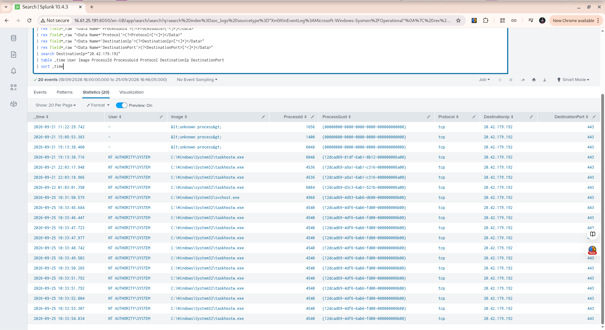

# Week 10 Exercise 07 — Advanced Analyst Case Documentation

## Case Overview

**Case ID:** `SOC-W10-EX07-001`

**Case Type:** IOC Investigation / Multi-Event Analysis

**Investigation Date:** `2026-09-25`

**Primary Indicator:** `20.42.179.192`

**Primary Protocol:** `TCP`

**Primary Destination Port:** `443`

**Affected Host:** Windows Server 2025 SOC Lab Endpoint

**Data Source:** Sysmon telemetry collected through Splunk

**Splunk Index:** `soc_logs`

---

## Objective

The objective of this case was to document a complete SOC analyst investigation involving the IP address `20.42.179.192`.

The investigation examined local occurrences of the indicator, identified the processes responsible for network connections, correlated network activity with process creation events, and investigated process ownership using both Process ID and ProcessGuid.

The investigation also considered incomplete process attribution, PID reuse, repeated network activity, and external indicator enrichment.

The purpose of the case was to demonstrate evidence-based investigation and analyst decision-making without automatically treating an indicator as malicious solely because it appeared in endpoint telemetry.

No new suspicious activity was generated for this exercise. Existing SOC lab telemetry was used throughout the investigation.

---

## Investigation Question

The primary investigation question was:

> **What activity on the Windows endpoint is associated with `20.42.179.192`, which processes are responsible for the connections, and does the available telemetry provide sufficient evidence to classify the activity as malicious?**

---

---

## Initial Evidence

The indicator `20.42.179.192` was identified during previous SOC lab investigations involving outbound Windows network connections.

A local Splunk search was performed against Sysmon Event ID 3 network connection telemetry.

The investigation identified **13 initial network events** associated with the indicator during the focused investigation period.

All 13 connections used TCP destination port `443`.

The initial results included:

| Time                                 | User   | Process         |  PID | Destination         |
| ------------------------------------ | ------ | --------------- | ---: | ------------------- |
| 2026-09-25 10:31:50.579              | SYSTEM | `svchost.exe`   | 4968 | `20.42.179.192:443` |
| 2026-09-25 10:33:45.684–10:33:54.834 | SYSTEM | `taskhostw.exe` | 4540 | `20.42.179.192:443` |

The initial evidence showed that the indicator was contacted by more than one Windows system process.

At this stage, the presence of the IP address alone was not considered sufficient evidence to classify the activity as malicious.

Further process correlation was therefore required.

---

## Initial Analyst Assessment

The initial findings raised several investigation questions:

1. Which process instances generated the network connections?
2. Was PID `4540` associated with the same process throughout the investigation period?
3. Could the network connections be correlated using ProcessGuid?
4. What parent processes were responsible for the observed activity?
5. Were there associated file or registry events?
6. Did the indicator appear repeatedly in other Windows processes?
7. What additional context could external IOC enrichment provide?

These questions formed the basis for the subsequent investigation.

---

---

## Process Correlation

The investigation focused on PID `4540`, which appeared in multiple events associated with the indicator.

PID `4540` was observed with two different process instances.

### Earlier Process Instance

At:

`2026-09-25 10:31:21.572`

PID `4540` was associated with:

```text
Process:       ROUTE.EXE
User:          SYSTEM
ProcessGuid:   {12dcad69-4d79-6ab6-8300-000000006b00}
Parent:        C:\Program Files\Amazon\EC2Launch\EC2Launch.exe
Parent PID:    3816
```

The command line was:

```text
C:\Windows\System32\route.exe DELETE 169.254.169.123/32
```

### Later Process Instance

At:

`2026-09-25 10:33:26.744`

the same PID `4540` was associated with a different process instance:

```text
Process:       taskhostw.exe
User:          SYSTEM
ProcessGuid:   {12dcad69-4df6-6ab6-fd00-000000006b00}
Parent:        C:\Windows\System32\svchost.exe
Parent PID:    1712
```

The parent command line was:

```text
C:\Windows\system32\svchost.exe -k netsvcs -p -s Schedule
```

The subsequent network connections to `20.42.179.192:443` were associated with the **taskhostw.exe ProcessGuid**, not the earlier ROUTE.EXE ProcessGuid.

### Analyst Finding

This demonstrated that PID `4540` had been reused by the operating system.

Therefore, PID alone could not safely be used to attribute the network activity.

The ProcessGuid provided the stronger process-instance correlation.

This is an important SOC investigation principle:

> **A PID identifies a process number, while ProcessGuid provides stronger evidence of the specific process instance involved in the event.**

The network activity was therefore attributed to the later `taskhostw.exe` process instance based on ProcessGuid correlation rather than PID alone.

---

## Taskhostw Process Analysis

The `taskhostw.exe` ProcessGuid:

```text
{12dcad69-4df6-6ab6-fd00-000000006b00}
```

was investigated across the available Sysmon telemetry.

The process generated **42 Event ID 3 network connection events**.

The observed destinations included:

| Destination IP    | Port | Event Count |
| ----------------- | ---: | ----------: |
| `172.215.188.225` |  443 |          13 |
| `20.42.179.192`   |  443 |          12 |
| `85.210.193.152`  |  443 |           8 |
| `40.84.97.4`      |  443 |           6 |
| `172.215.188.232` |  443 |           1 |
| `4.247.188.224`   |  443 |           1 |
| `57.155.104.224`  |  443 |           1 |

All observed connections used destination port `443`.

The process was also checked for related file and registry activity.

No Event ID 11, 12, 13, or 14 events were identified for this exact ProcessGuid in the available telemetry.

---

## Parent Process Analysis

The parent process of `taskhostw.exe` was:

```text
C:\Windows\System32\svchost.exe
```

with the command:

```text
C:\Windows\system32\svchost.exe -k netsvcs -p -s Schedule
```

This indicates that the `taskhostw.exe` process was launched under the Windows Task Scheduler service context.

The parent `svchost.exe` process was itself associated with:

```text
Parent: C:\Windows\System32\services.exe
PID:    760
```

The observed process relationship was:

```text
services.exe
    |
    └── svchost.exe
          |
          └── taskhostw.exe
                |
                └── Network connections
```

The available telemetry therefore provided a process lineage for the network activity associated with the indicator.

---

---

## IOC Enrichment

The indicator `20.42.179.192` was also reviewed using external threat-intelligence information.

The available enrichment identified the IP address as associated with:

* **Organization:** Microsoft Corporation
* **ASN:** `AS8075`
* **Domain:** `microsoft.com`
* **Country:** United States
* **Usage Type:** Data Center / Web Hosting / Transit
* **Abuse Confidence Score:** 3%
* **Reported by:** 2 reporters
* **Abuse Reports:** 92

Some reports associated the address with port-scanning activity.

However, external reputation information was treated as supporting context rather than definitive evidence of malicious activity.

An IP address belonging to a major cloud or hosting provider can be used by both legitimate and malicious infrastructure. Therefore, the reputation information was evaluated together with the endpoint telemetry.

---

## Local and External Evidence Comparison

| Evidence               | Observation                                                       | Analyst Significance                                 |
| ---------------------- | ----------------------------------------------------------------- | ---------------------------------------------------- |
| Local network activity | `20.42.179.192:443` contacted by Windows SYSTEM processes         | Requires process correlation                         |
| Process attribution    | `taskhostw.exe` associated with 12 connections                    | Provides process context                             |
| ProcessGuid            | Valid ProcessGuid identified for taskhostw.exe                    | Stronger than PID alone                              |
| PID reuse              | PID `4540` previously belonged to `ROUTE.EXE`                     | Demonstrates need for ProcessGuid                    |
| Parent process         | `taskhostw.exe` launched through `svchost.exe` / Schedule service | Provides process lineage                             |
| File activity          | No Event ID 11 for exact taskhostw ProcessGuid                    | No correlated file-creation evidence observed        |
| Registry activity      | No Event ID 12/13/14 for exact ProcessGuid                        | No correlated registry evidence observed             |
| Network behavior       | Multiple HTTPS destinations contacted                             | Destination alone is insufficient for classification |
| External enrichment    | Low abuse confidence score with limited reporting                 | Supporting context, not proof of maliciousness       |

---

## Evidence Assessment

The investigation produced evidence both for further review and against an immediate malicious classification.

### Evidence Requiring Review

The following observations warranted investigation:

* The indicator was contacted multiple times.
* The connections were generated by Windows SYSTEM processes.
* Some network events contained incomplete process attribution.
* The same PID was reused by different process instances.
* External enrichment contained some abuse reports.

### Evidence Limiting the Malicious Assessment

The following findings reduced the strength of a malicious interpretation:

* The indicator was contacted through TCP port `443`, which is commonly used for legitimate HTTPS traffic.
* The destination was contacted by multiple Windows system processes.
* The activity occurred across multiple dates rather than appearing as a single isolated connection.
* ProcessGuid correlation showed that PID reuse could otherwise produce incorrect attribution.
* No file-creation events were associated with the exact taskhostw ProcessGuid.
* No registry events were associated with the exact taskhostw ProcessGuid.
* The available telemetry did not show a clear malicious process, command line, persistence mechanism, or other confirmed malicious behavior associated with the indicator.

The evidence therefore required contextual interpretation rather than an automatic malicious classification.

---

## Analyst Decision

Based on the available endpoint telemetry and IOC enrichment, the investigation did **not identify sufficient evidence to classify the observed activity as confirmed malicious**.

The appropriate analyst disposition for this exercise was:

**Needs context / no confirmed malicious activity identified.**

This assessment is limited to the telemetry available in the SOC lab and should not be interpreted as a statement that the IP address is universally benign.

---


---

## Investigation Timeline

The investigation was reconstructed from the available Sysmon telemetry.

| Time          | Event                | Process         | Finding                                               |
| ------------- | -------------------- | --------------- | ----------------------------------------------------- |
| 10:31:21.572  | Process Creation     | `ROUTE.EXE`     | PID `4540` used by earlier process instance           |
| 10:31:50.579  | Network Connection   | `svchost.exe`   | Connection to `20.42.179.192:443`                     |
| 10:33:26.744  | Process Creation     | `taskhostw.exe` | PID `4540` reused with a new ProcessGuid              |
| 10:33:45.684  | Network Connection   | `taskhostw.exe` | Connection to `20.42.179.192:443`                     |
| 10:33:54.834  | Network Connection   | `taskhostw.exe` | Additional connection to indicator                    |
| Investigation | Correlation          | `taskhostw.exe` | 42 Event ID 3 events identified for exact ProcessGuid |
| Investigation | File/Registry Review | `taskhostw.exe` | No Event ID 11/12/13/14 activity identified           |

The timeline demonstrated that the indicator was associated with multiple Windows processes and that PID reuse could have caused incorrect attribution if ProcessGuid had not been used.

---

## Investigation Outcome

The investigation successfully established the following:

1. `20.42.179.192` was contacted by multiple Windows SYSTEM processes.
2. PID `4540` was reused by different process instances.
3. The later `taskhostw.exe` process was correctly identified using its ProcessGuid.
4. The `taskhostw.exe` process generated multiple outbound HTTPS connections.
5. The process was launched through the Windows Task Scheduler service context.
6. No correlated file creation or registry activity was identified for the exact taskhostw ProcessGuid.
7. External enrichment provided additional context but did not independently establish malicious activity.
8. The available telemetry did not provide sufficient evidence to classify the activity as confirmed malicious.

---

## SOC Analyst Lessons Learned

### Process Correlation

Process IDs should not be treated as unique identifiers for the lifetime of an investigation.

PID reuse can result in unrelated process instances sharing the same numeric PID. ProcessGuid provides stronger process-instance correlation when available.

### Contextual IOC Investigation

An IP address should not automatically be treated as malicious simply because it appears in endpoint telemetry or external threat-intelligence reports.

The surrounding process, user, destination, timing, frequency, and related endpoint activity must be considered.

### Parent-Child Relationships

Understanding process lineage helps determine how network activity originated.

The investigation demonstrated the relationship:

```text
services.exe
    |
    └── svchost.exe
          |
          └── taskhostw.exe
                |
                └── Network activity
```

### Missing Telemetry

A missing Sysmon event should be treated as a telemetry limitation rather than proof that an action did not occur.

This is particularly important when investigating file, registry, or network behavior.

### Evidence-Based Disposition

The analyst should distinguish between:

* An indicator requiring investigation
* An indicator associated with suspicious behavior
* Confirmed malicious activity

These are not automatically equivalent.

---

## Final Analyst Conclusion

The investigation of `20.42.179.192` demonstrated why SOC analysts must correlate multiple sources of endpoint evidence before making a determination.

The IP address was observed in repeated HTTPS connections from Windows SYSTEM processes. Process correlation established that PID reuse occurred and that the relevant network activity was associated with a specific `taskhostw.exe` ProcessGuid.

The available telemetry did not identify correlated file creation, registry modification, or another confirmed malicious behavior associated with the investigated process.

External enrichment provided additional context but was not sufficient by itself to establish malicious activity.

Based on the evidence reviewed, the case did not contain sufficient evidence to classify the observed activity as confirmed malicious.

**Final Disposition: Needs context / no confirmed malicious activity identified.**

This conclusion is limited to the endpoint telemetry available in the SOC lab and the specific process and indicator activity investigated.

---

## Case Closure

**Case Status:** Closed — No Confirmed Malicious Activity

**Primary Indicator:** `20.42.179.192`

**Investigation Type:** IOC / Multi-Event Investigation

**Evidence Sources:** Sysmon, Splunk, external IOC enrichment

**Primary Investigation Techniques:**

* Event ID correlation
* ProcessGuid correlation
* PID reuse analysis
* Process-tree analysis
* Network connection analysis
* File and registry activity review
* IOC enrichment
* Evidence-based disposition

---

## Validation Evidence

The following screenshot documents the investigation evidence used during the case:


