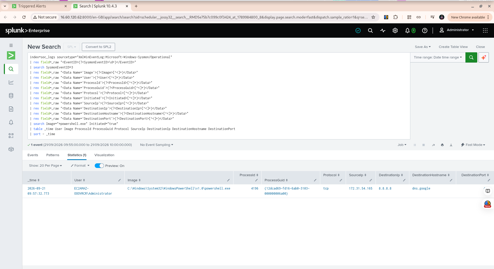

# Week 7 — Alerting and Incident Triage

## Objective

The objective of Week 7 was to progress from detection engineering into alerting and analyst triage.

The lab was configured to generate a Splunk alert when PowerShell initiated an outbound network connection. The alert was scheduled to run every five minutes and investigate the previous five minutes of Windows Sysmon telemetry.

## Detection

**Alert name:** `SOC - PowerShell Network Connection`

**Severity:** Medium

**Schedule:** Every 5 minutes

**Search window:** Last 5 minutes

**Trigger condition:** Number of results greater than 0

**Action:** Add to Triggered Alerts

The detection searches the `soc_logs` index for Sysmon Event ID 3 network connection events and identifies connections initiated by PowerShell.

## Controlled Validation

A controlled test was performed on the Windows Server endpoint using:

```powershell
Test-NetConnection 8.8.8.8 -Port 443
```

The command successfully generated a Sysmon network connection event.

The resulting event was forwarded through the Splunk Universal Forwarder and ingested into Splunk.

## Alert Evidence

The scheduled alert successfully triggered and produced an event.

The alert result contained the following evidence:

| Field                | Value                                                       |
| -------------------- | ----------------------------------------------------------- |
| Event time           | `2026-09-21 09:57:32.773`                                   |
| User                 | `EC2AMAZ-OOOVRCR\Administrator`                             |
| Image                | `C:\Windows\System32\WindowsPowerShell\v1.0\powershell.exe` |
| Process ID           | `4196`                                                      |
| Process GUID         | `{12dcad69-fd16-6ab0-3103-000000006a00}`                    |
| Protocol             | `tcp`                                                       |
| Source IP            | `172.31.54.165`                                             |
| Destination IP       | `8.8.8.8`                                                   |
| Destination hostname | `dns.google`                                                |
| Destination port     | `443`                                                       |

## Analyst Triage

The alert was investigated by reviewing the process, user, source, destination, protocol, and destination port.

The activity was determined to be **benign and expected lab activity** because the network connection was intentionally generated during controlled detection testing.

The destination was `8.8.8.8` (`dns.google`) over TCP port `443`.

The alert therefore demonstrated that the detection was functioning correctly rather than indicating a confirmed malicious incident.

## Analyst Decision

**Disposition:** Benign / Expected Activity

**Reason:** Controlled test generated intentionally to validate the PowerShell network connection detection and scheduled alert.

**Escalation:** Not required.

## SOC Workflow Demonstrated

This exercise demonstrated the following SOC workflow:

1. Generate controlled endpoint activity.
2. Record the activity with Sysmon.
3. Forward telemetry using the Splunk Universal Forwarder.
4. Ingest the event into Splunk.
5. Detect the activity using SPL.
6. Generate a scheduled alert.
7. Review the triggered alert.
8. Investigate the underlying evidence.
9. Determine the appropriate analyst disposition.

## Key Lesson

An alert is not automatically evidence of a successful attack.

A SOC analyst must investigate the underlying telemetry, establish context, and determine whether the activity is malicious, benign, or requires further investigation.

This exercise demonstrated the complete path from endpoint activity to detection, alerting, and analyst triage.

## Validation Evidence

The screenshot below shows the Splunk alert results generated during the controlled PowerShell network connection test.


