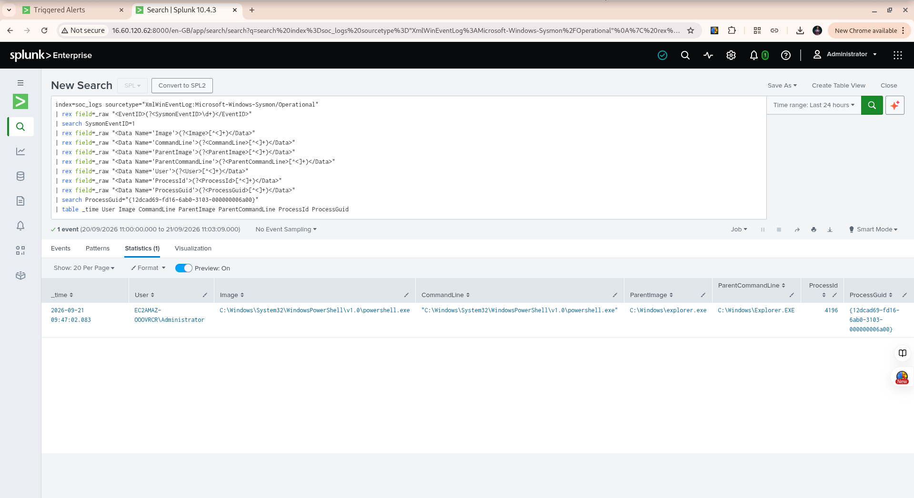

# Week 8 — Threat Hunt #1: PowerShell Network Activity

## Objective

This threat hunt proactively investigated whether PowerShell was initiating outbound network connections from the Windows endpoint that required further investigation.

The goal was to search existing Sysmon telemetry, identify PowerShell network activity, and correlate the network event with the corresponding process-creation event.

---

## Threat Hypothesis

> PowerShell may be initiating outbound network connections from the Windows endpoint that deserve investigation.

The hypothesis does not assume that PowerShell activity is malicious. The purpose of the hunt was to determine whether the available telemetry contained activity requiring further investigation.

---

## Data Source

The investigation used:

* Windows Server 2025 endpoint
* Sysmon
* Splunk Universal Forwarder
* Splunk Enterprise
* Index: `soc_logs`
* Sourcetype: `XmlWinEventLog:Microsoft-Windows-Sysmon/Operational`

The primary Sysmon events used were:

* Event ID 3 — Network Connection
* Event ID 1 — Process Creation

---

## Hunt 1 — Broad Network Connection Search

The first search examined Sysmon Event ID 3 network connections from the Windows endpoint.

The search returned:

**148 events**

The results contained network activity from several Windows and system processes, including:

* Microsoft Defender
* `svchost.exe`
* `amazon-ssm-agent.exe`
* Microsoft Edge WebView
* PowerShell
* Several events with incomplete process attribution

This broad search provided the starting point for narrowing the investigation.

---

## Hunt 1 — PowerShell Network Activity

The search was then narrowed to Sysmon Event ID 3 events where the process image contained:

`powershell.exe`

The search returned:

**2 events**

Both events involved:

* User: `EC2AMAZ-OOOVRCR\Administrator`
* Process: `C:\Windows\System32\WindowsPowerShell\v1.0\powershell.exe`
* Destination IP: `8.8.8.8`
* Destination hostname: `dns.google`
* Destination port: `443`
* Protocol: TCP
* Initiated: `true`

The two observed connection times were:

* `2026-09-21 09:48:21.295`
* `2026-09-21 09:57:32.773`

---

## Process Correlation

The `ProcessGuid` from the network connection was used to correlate the PowerShell activity with Sysmon Event ID 1 process-creation telemetry.

The correlated process was:

* User: `EC2AMAZ-OOOVRCR\Administrator`
* Image: `C:\Windows\System32\WindowsPowerShell\v1.0\powershell.exe`
* Process ID: `4196`
* Process GUID: `{12dcad69-fd16-6ab0-3103-000000006a00}`
* Parent Image: `C:\Windows\explorer.exe`
* Parent Command Line: `C:\Windows\Explorer.EXE`
* Command Line: `"C:\Windows\System32\WindowsPowerShell\v1.0\powershell.exe"`

This established the process relationship:

`explorer.exe → powershell.exe → outbound network connection`

---

## Investigation Findings

The investigated PowerShell network activity was associated with controlled testing performed in the SOC lab.

The network connection to `8.8.8.8:443` was generated using:

`Test-NetConnection 8.8.8.8 -Port 443`

The correlated Sysmon Event ID 1 record showed PowerShell running under the lab Administrator account and being launched from `explorer.exe`.

The available evidence did not indicate malicious activity for the investigated events.

### Analyst Disposition

**Benign / Expected Lab Activity**

This disposition applies specifically to the investigated events and does not mean that all PowerShell network activity should be considered benign.

---

## Key SOC Analyst Lesson

A threat hunt should not stop when a potentially suspicious event is discovered.

The investigation should continue by asking:

1. What happened?
2. Which process generated the activity?
3. Which user was involved?
4. What process launched it?
5. What destination was contacted?
6. Is the activity expected or unexplained?
7. What additional evidence is available?

In this hunt, the network event was correlated with process-creation telemetry using `ProcessGuid`, providing additional context for the analyst.

---

## Validation Evidence

The final correlation result was validated in Splunk.

The screenshot shows the correlated PowerShell process, its parent process, user, Process ID, and Process GUID.

---

## Conclusion

Threat Hunt #1 successfully demonstrated a proactive investigation of PowerShell network activity.

The hunt began with a broad search of Sysmon network connections, narrowed the results to PowerShell activity, and then correlated the network event with Sysmon process-creation telemetry.

The investigated activity was determined to be expected lab testing rather than confirmed malicious activity.

This hunt demonstrates the importance of combining network telemetry with process context during SOC investigations.
