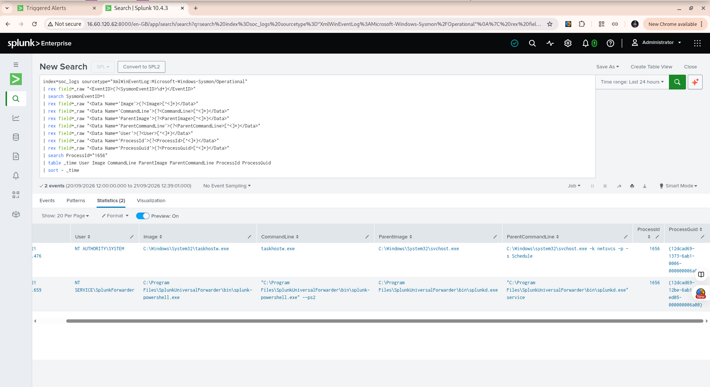
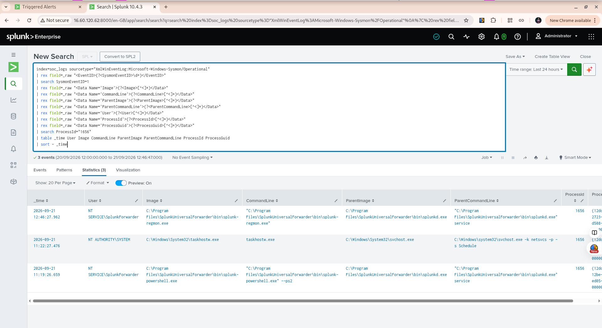

# Week 8 Threat Hunt #2 — Incomplete Process Attribution for Outbound Network Activity

## Hunt Overview

**Week:** 8
**Category:** Threat Hunting
**Hunt:** 02 — Incomplete Process Attribution
**Platform:** Splunk Enterprise
**Data Source:** Windows Server 2025 / Sysmon
**Index:** `soc_logs`
**Sourcetype:** `XmlWinEventLog:Microsoft-Windows-Sysmon/Operational`

---

## Threat Hypothesis

> Some outbound network connections may have incomplete process attribution and should be investigated to determine which processes generated them.

The purpose of this hunt was not to assume that an unknown process was malicious, but to investigate whether available Sysmon telemetry could identify the process responsible for an outbound network connection.

---

## Hunt Objective

The objective was to:

1. Identify Sysmon Event ID 3 network connections with incomplete process attribution.
2. Investigate events containing `<unknown process>` and missing user information.
3. Correlate the network event with Sysmon Event ID 1 process creation events.
4. Compare Process ID, ProcessGuid, timestamps, and parent-process information.
5. Determine whether the network connection could be confidently attributed to a specific process.

---

## Initial Observation

The broad outbound network hunt identified several events where the extracted process information appeared as:

* **Image:** `<unknown process>`
* **User:** `-`
* **ProcessGuid:** all zeros

One of the newest examples occurred at:

**2026-09-21 11:22:29.742**

The connection was:

* **Protocol:** TCP
* **Source IP:** `172.31.54.165`
* **Source Process ID:** `1656`
* **Destination IP:** `20.42.179.192`
* **Destination Port:** `443`
* **Destination Hostname:** `-`
* **Image:** `<unknown process>`
* **User:** `-`
* **ProcessGuid:** `{00000000-0000-0000-0000-000000000000}`

---

## Network Event Investigation

The network event was investigated using Sysmon Event ID 3 telemetry.

The destination-specific search showed that:

```text
20.42.179.192
```

appeared only once in the available network telemetry.

The event therefore represented an isolated network connection in the current dataset rather than a destination repeatedly observed in the available telemetry.

---

## Process ID Correlation

The network event used:

```text
ProcessId: 1656
```

A search for Sysmon Event ID 1 process creation events using PID `1656` returned two different process instances.

### Relevant process instance

**Time:** `2026-09-21 11:22:27.476`

```text
User: NT AUTHORITY\SYSTEM
Image: C:\Windows\System32\taskhostw.exe
CommandLine: taskhostw.exe
ParentImage: C:\Windows\System32\svchost.exe
ParentCommandLine: C:\Windows\system32\svchost.exe -k netsvcs -p -s Schedule
ProcessId: 1656
ProcessGuid: {12dcad69-1373-6ab1-0006-000000006a00}
```

The process creation event occurred approximately **2.3 seconds before** the unknown-process network event.

This provides a strong temporal and PID correlation.

---

## PID Reuse Investigation

Another process had previously used PID `1656`:

```text
Time: 2026-09-21 11:19:26.659
User: NT SERVICE\SplunkForwarder
Image: C:\Program Files\SplunkUniversalForwarder\bin\splunk-powershell.exe
ProcessId: 1656
ProcessGuid: {12dcad69-12be-6ab1-ed05-0006-000000006a00}
```

This process occurred several minutes before the network event and had a different ProcessGuid.

This demonstrates why **PID alone should not be treated as a unique process identifier**.

Windows can reuse process IDs after a process terminates. ProcessGuid and timestamps provide stronger correlation between process instances.

---

## ProcessGuid Correlation

The ProcessGuid associated with the relevant `taskhostw.exe` process was:

```text
{12dcad69-1373-6ab1-0006-000000006a00}
```

A search across the available Sysmon telemetry for this exact ProcessGuid returned the process creation event, but did not produce a matching Event ID 3 network event containing the same ProcessGuid.

Therefore, the network event cannot be directly linked to the taskhostw.exe process through ProcessGuid.

---

## Taskhostw.exe Context

Additional investigation showed that `taskhostw.exe` is frequently created on the Windows endpoint.

The search returned:

**67 taskhostw.exe process creation events**

during the available search period.

A recurring process hierarchy was observed:

```text
svchost.exe
    └── taskhostw.exe
```

with the parent command:

```text
C:\Windows\system32\svchost.exe -k netsvcs -p -s Schedule
```

The observed user contexts included:

```text
NT AUTHORITY\SYSTEM
EC2AMAZ-OOOVRCR\Administrator
```

This indicates that taskhostw.exe activity is recurring in the lab environment and is associated with Windows Task Scheduler activity.

---

## Taskhostw.exe Network Activity

The available Sysmon Event ID 3 telemetry also showed recurring network activity attributed directly to taskhostw.exe.

A total of:

**43 taskhostw.exe network events**

were identified.

The observed destination IPs were:

| Destination IP   | Port | Events |
| ---------------- | ---: | -----: |
| `20.42.179.204`  |  443 |     17 |
| `40.84.85.40`    |  443 |     15 |
| `4.247.188.233`  |  443 |      7 |
| `57.155.104.224` |  443 |      3 |
| `85.210.196.11`  |  443 |      1 |

These observations show that taskhostw.exe has recurring HTTPS network activity in the lab environment.

However, this does **not** prove that taskhostw.exe generated the investigated connection to `20.42.179.192`.

---

## Correlation Assessment

The evidence can be summarized as follows:

| Evidence                 | Finding                               |
| ------------------------ | ------------------------------------- |
| Network event            | TCP connection to `20.42.179.192:443` |
| Network process image    | `<unknown process>`                   |
| Network user             | `-`                                   |
| Network PID              | `1656`                                |
| Network ProcessGuid      | All zeros                             |
| Matching recent process  | `taskhostw.exe`                       |
| Matching PID             | `1656`                                |
| Process creation time    | 11:22:27.476                          |
| Network event time       | 11:22:29.742                          |
| Time difference          | ~2.3 seconds                          |
| Process parent           | `svchost.exe` Task Scheduler service  |
| Direct ProcessGuid match | Not available                         |

---

## Finding

The hunt identified an outbound TCP connection where Sysmon did not provide complete process attribution.

The event's PID and timestamp strongly correlate with a `taskhostw.exe` process that was created approximately 2.3 seconds earlier by the Windows Task Scheduler service.

However, the network event contained an all-zero ProcessGuid and did not contain usable Image or User information.

The taskhostw.exe ProcessGuid search also did not produce a matching network event.

Therefore, **taskhostw.exe cannot be definitively identified as the process responsible for the investigated network connection**.

---

## Analyst Assessment

The primary finding is a **process-attribution / telemetry gap**.

The available evidence does not establish that the investigated connection was malicious.

The investigation also demonstrated an important SOC analysis principle:

> A correlation based only on Process ID is insufficient when process IDs can be reused.

Process ID, ProcessGuid, timestamp, parent process, user context, and other available telemetry should be considered together when investigating Windows process activity.

---

## Analyst Disposition

**Disposition:** Requires awareness / telemetry attribution gap

**Malicious activity confirmed:** No

**Reason:** The available Sysmon telemetry does not provide enough direct evidence to confidently attribute the network connection to a specific process.

---

## Lessons Learned

### 1. Unknown process does not automatically mean malicious

An `<unknown process>` network event is an investigation lead, not proof of compromise.

### 2. PID alone is not enough

The investigation found that PID `1656` had been used by more than one process instance.

### 3. ProcessGuid provides stronger correlation

ProcessGuid can distinguish different process instances that used the same PID.

### 4. Time correlation matters

The `taskhostw.exe` process creation event occurred approximately 2.3 seconds before the unknown network connection.

This makes it an important correlation candidate, but not definitive proof.

### 5. Detection and threat hunting are different

The purpose of this hunt was not simply to find a suspicious event.

The objective was to investigate an unusual telemetry condition and determine what could and could not be established from the available evidence.

---

## Conclusion

Threat Hunt #2 identified an outbound network connection with incomplete process attribution.

The investigation correlated the event's PID and timestamp with a `taskhostw.exe` process created by the Windows Task Scheduler service. However, the absence of a usable ProcessGuid and process image in the network event prevented definitive attribution.

The hunt therefore demonstrates a **telemetry attribution gap rather than confirmed malicious activity**.

This investigation also reinforced the importance of correlating Sysmon Event ID 3 network events with Event ID 1 process creation events using multiple fields rather than relying on Process ID alone.

---

## Validation Evidence

The investigation was performed in Splunk against the Windows Server 2025 Sysmon telemetry stored in the `soc_logs` index.

Evidence reviewed included:

* Sysmon Event ID 3 outbound network telemetry
* Sysmon Event ID 1 process creation telemetry
* Process ID correlation
* ProcessGuid correlation
* Timestamp correlation
* Parent-process information
* taskhostw.exe process prevalence
* taskhostw.exe network activity

### Evidence 1 — Unknown Process Network Connection

The first screenshot shows the outbound network event with incomplete process attribution.



### Evidence 2 — PID 1656 Process Correlation

The second screenshot shows the two process instances associated with PID `1656`.

The results demonstrate that PID `1656` was used by different process instances with different ProcessGuid values. This supports the finding that PID alone is insufficient for definitive process attribution.


