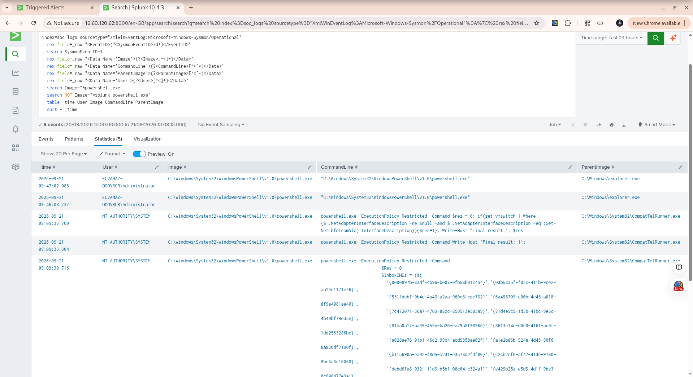

# Week 8 Threat Hunt #3 — PowerShell Execution Indicators

## Hunt Overview

This threat hunt investigated PowerShell process creation activity on the Windows endpoint to identify command-line execution patterns that may require further investigation.

The hunt focused on selected PowerShell execution indicators, including encoded commands, execution policy bypass, and hidden window execution.

The purpose of this hunt was not to assume that PowerShell activity was malicious, but to determine whether the available Sysmon telemetry contained evidence that warranted further investigation.

---

## Threat Hypothesis

> PowerShell processes may contain command-line arguments that deserve investigation, particularly commands involving encoded or hidden execution.

---

## Hunt Objective

The objectives of this hunt were to:

1. Identify PowerShell process creation events.
2. Exclude known Splunk Universal Forwarder PowerShell helper activity.
3. Review the remaining Windows PowerShell executions.
4. Search for selected suspicious execution indicators.
5. Determine whether additional investigation was required.

---

## Initial Search

The initial search examined Sysmon Event ID 1 process creation events involving PowerShell.

The search initially returned **459 PowerShell-related process creation events**.

A large portion of these events were associated with:

- `splunk-powershell.exe`
- `splunkd.exe`
- `NT SERVICE\SplunkForwarder`

These events represent expected Splunk Universal Forwarder activity in the lab environment.

---

## Noise Reduction

The Splunk PowerShell helper process was excluded from the investigation:

```spl
| search NOT Image="*splunk-powershell.exe"

After excluding this expected telemetry, the search returned 5 Windows PowerShell process creation events.

This reduced the dataset to PowerShell activity that was more relevant to the threat-hunting hypothesis.

PowerShell Event Review

The five remaining events consisted of two main activity patterns.

Administrator PowerShell Activity

Two PowerShell processes were launched by:

C:\Windows\explorer.exe

The processes were executed by:

EC2AMAZ-OOOVRCR\Administrator

The command line for these events was the normal PowerShell executable without additional suspicious execution arguments.

These events were consistent with interactive PowerShell use in the lab environment.

SYSTEM PowerShell Activity

Three PowerShell processes were executed under:

NT AUTHORITY\SYSTEM

The parent process was:

C:\Windows\System32\CompatTelRunner.exe

The observed commands used:

-ExecutionPolicy Restricted

The commands performed system compatibility or telemetry-related checks.

The parent-child process relationship and restricted execution policy provided useful context for analyst review.

Suspicious Execution Option Hunt

A targeted search was performed for selected PowerShell execution indicators:

-enc
-EncodedCommand
-ExecutionPolicy Bypass
-WindowStyle Hidden

The search returned:

0 events

This means that no process creation events in the investigated telemetry matched those selected indicators.

Finding

No suspicious PowerShell execution indicators were identified in the available Sysmon process-creation telemetry for the investigated time range.

The hunt identified five Windows PowerShell events after excluding the known Splunk helper process.

The observed activity consisted of:

Two Administrator PowerShell launches from explorer.exe.
Three SYSTEM PowerShell commands launched by CompatTelRunner.exe.
Zero matches for the selected encoded, bypass, or hidden execution indicators.
Analyst Assessment

The available evidence did not identify the specific PowerShell execution indicators targeted by this hunt.

The SYSTEM PowerShell activity occurred in the context of CompatTelRunner.exe and used -ExecutionPolicy Restricted, which provided additional context for the analyst review.

The Administrator PowerShell processes were launched from explorer.exe and did not contain the selected suspicious execution arguments.

Based on the available telemetry, no further investigation was required for the specific indicators targeted by this hunt.

Analyst Disposition

Disposition: No suspicious PowerShell execution indicators identified.

Malicious activity confirmed: No.

This disposition applies only to the activity and indicators examined during this hunt.

It does not mean that all PowerShell activity is benign or that malicious PowerShell activity is impossible.

Lessons Learned

This hunt demonstrated several important SOC analyst techniques:

Start broad, then narrow the search.
The initial search identified the overall PowerShell activity.
Reduce known telemetry noise.
Splunk's splunk-powershell.exe activity was excluded because it was expected in this lab.
Examine process context.
Parent processes, users, and command lines helped determine how PowerShell was launched.
Search for specific execution indicators.
Encoded commands, execution-policy bypass, and hidden-window options were tested as targeted indicators.
Understand the limits of a hunt.
Finding zero matches for specific indicators does not prove that PowerShell activity can never be malicious.
Conclusion

Week 8 Threat Hunt #3 successfully examined PowerShell process creation activity using Sysmon Event ID 1 telemetry.

After reducing expected Splunk Forwarder activity, five Windows PowerShell events were reviewed.

The targeted search for selected suspicious PowerShell execution indicators returned zero events.

The hunt therefore found no evidence of the specific PowerShell execution indicators being investigated within the available telemetry.

This demonstrates the importance of combining broad discovery, noise reduction, process context, targeted searches, and evidence-based analyst conclusions during threat hunting.

Validation Evidence

The final Splunk search results were captured as validation evidence.

The screenshot shows the final five-event PowerShell dataset used for the investigation.


## Validation Evidence

The final Splunk search results were captured as validation evidence.



The screenshot shows the final five-event PowerShell dataset used for the investigation.
