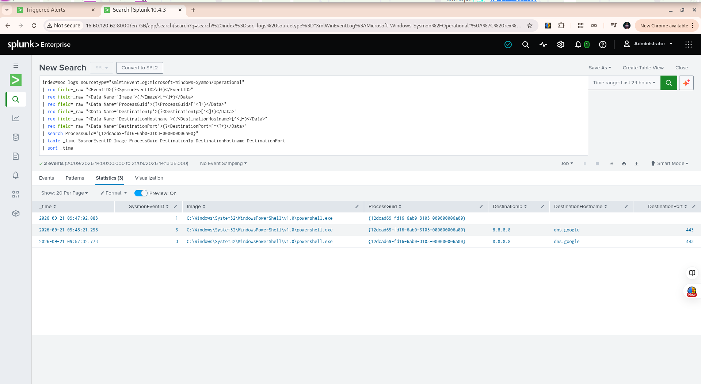

# Week 9 — Incident Response Exercise 01: PowerShell Network Connection

## 1. Incident Overview

This incident response exercise investigated a scheduled Splunk alert for a PowerShell-initiated network connection.

The alert was generated by the Week 7 detection:

**SOC - PowerShell Network Connection**

The purpose of this exercise was to demonstrate the incident response workflow:

**Alert → Validate → Scope → Investigate → Contain → Document → Close**

The investigation used Windows Sysmon telemetry collected by the Splunk Universal Forwarder and indexed in Splunk under `soc_logs`.

---

## 2. Alert Details

**Alert name:** `SOC - PowerShell Network Connection`

**Detection purpose:** Identify outbound network connections initiated by PowerShell for SOC analyst investigation.

**Severity:** Medium

**Detection schedule:** Every 5 minutes

**Time range:** Last 5 minutes

The alert identified PowerShell network activity from the Windows endpoint.

---

## 3. Initial Alert Validation

The initial investigation searched Sysmon Event ID 3 network connection events where the process image contained `powershell.exe`.

The investigation identified two network connection events associated with the same PowerShell process.

Both connections were:

* Destination IP: `8.8.8.8`
* Destination hostname: `dns.google`
* Destination port: `443`
* Protocol: TCP
* Initiated: `true`

The PowerShell process was associated with:

* User: `EC2AMAZ-OOOVRCR\Administrator`
* Process ID: `4196`
* ProcessGuid: `{12dcad69-fd16-6ab0-3103-000000006a00}`

---

## 4. Process Investigation

Sysmon Event ID 1 was searched using the exact ProcessGuid.

The investigation identified the process creation event:

* Time: `2026-09-21 09:47:02.083`
* User: `EC2AMAZ-OOOVRCR\Administrator`
* Image: `C:\Windows\System32\WindowsPowerShell\v1.0\powershell.exe`
* CommandLine: `"C:\Windows\System32\WindowsPowerShell\v1.0\powershell.exe"`
* ParentImage: `C:\Windows\explorer.exe`
* ParentCommandLine: `C:\Windows\Explorer.EXE`
* ProcessId: `4196`
* ProcessGuid: `{12dcad69-fd16-6ab0-3103-000000006a00}`

The parent-child relationship was therefore:

```text
explorer.exe
    |
    └── powershell.exe
```

---

## 5. Process-Level Correlation

A search across Sysmon events using the exact ProcessGuid produced three events.

### Event 1 — Process Creation

**Time:** `2026-09-21 09:47:02.083`

**Sysmon Event ID:** `1`

PowerShell was launched by `explorer.exe`.

### Event 2 — Network Connection

**Time:** `2026-09-21 09:48:21.295`

**Sysmon Event ID:** `3`

PowerShell connected to:

`8.8.8.8:443`

Hostname:

`dns.google`

### Event 3 — Network Connection

**Time:** `2026-09-21 09:57:32.773`

**Sysmon Event ID:** `3`

PowerShell connected again to:

`8.8.8.8:443`

Hostname:

`dns.google`

All three events shared:

```text
ProcessGuid: {12dcad69-fd16-6ab0-3103-000000006a00}
```

This provided process-level correlation between the process creation and both network connections.

---

## 6. Timeline

```text
09:47:02
explorer.exe
    |
    └── powershell.exe created
          |
          | ProcessGuid:
          | {12dcad69-fd16-6ab0-3103-000000006a00}
          |
09:48:21
          └── TCP connection → 8.8.8.8:443
                              dns.google

09:57:32
          └── TCP connection → 8.8.8.8:443
                              dns.google
```

---

## 7. Investigation Findings

The PowerShell network activity was investigated using Sysmon process creation and network connection telemetry.

The same ProcessGuid was present across the process creation event and both network connection events.

The investigated network connections were generated during controlled SOC lab testing using:

```powershell
Test-NetConnection 8.8.8.8 -Port 443
```

The activity therefore corresponds to expected lab-generated network activity.

No evidence from the investigated events established malicious activity.

---

## 8. Incident Disposition

**Classification:** Benign / Expected Lab Activity

**Malicious activity confirmed:** No

**Containment required:** No

**Escalation required:** No

**Root cause:** Controlled connectivity testing performed as part of the SOC Analyst Home Lab.

This disposition applies specifically to the investigated alert and associated activity. It does not mean that all PowerShell network connections should automatically be considered benign.

---

## 9. Containment Decision

No containment action was performed.

The evidence showed that the activity originated from a controlled test performed within the SOC lab.

Terminating the process or isolating the endpoint was therefore unnecessary for this exercise.

This demonstrates an important incident response principle: containment decisions should be based on the available evidence and assessed risk rather than being performed automatically whenever an alert fires.

---

## 10. Evidence

### Splunk Timeline

The final Splunk investigation identified three Sysmon events associated with the same ProcessGuid:

* Event ID 1 — PowerShell process creation
* Event ID 3 — First network connection
* Event ID 3 — Second network connection

Screenshot:



---

## 11. Analyst Lessons Learned

This exercise demonstrated several important incident response concepts:

1. A detection alert is an investigation starting point, not automatically a confirmed incident.
2. ProcessGuid provides stronger process correlation than relying only on ProcessId.
3. Sysmon Event ID 1 can establish process creation and parent-child relationships.
4. Sysmon Event ID 3 can provide network connection evidence.
5. Correlating process and network telemetry creates a clearer incident timeline.
6. Controlled lab activity can legitimately trigger security detections.
7. Analyst investigation is required before deciding whether containment or escalation is necessary.
8. Incident disposition should be based on evidence collected during the investigation.

---

## 12. Final Status

**Incident Response Exercise 01: Complete**

**Final disposition:** Benign / Expected Lab Activity

**Evidence collected:** Yes

**Containment performed:** No

**Escalation required:** No

**Documentation:** Complete
