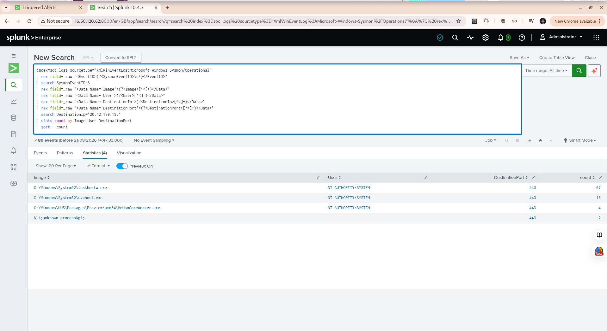

# Week 9 — Incident Response Exercise 02: Unknown Process Network Activity

## Overview

This incident response exercise investigated an outbound network connection that appeared in Sysmon network telemetry with incomplete process attribution.

The investigation followed the SOC incident response workflow:

> **Alert → Validate → Scope → Investigate → Contain → Document → Close**

The purpose of the investigation was to determine whether the event represented confirmed malicious activity or a telemetry/process-attribution issue.

---

## 1. Incident Summary

| Field                | Value                                       |
| -------------------- | ------------------------------------------- |
| Incident Type        | Unknown-process outbound network connection |
| Sysmon Event ID      | 3 — Network Connection                      |
| Event Time           | 2026-09-21 11:22:29.742                     |
| Source IP            | `172.31.54.165`                             |
| Source PID           | `1656`                                      |
| User                 | `-`                                         |
| Image                | `<unknown process>`                         |
| ProcessGuid          | `{00000000-0000-0000-0000-000000000000}`    |
| Protocol             | TCP                                         |
| Initiated            | `true`                                      |
| Destination IP       | `20.42.179.192`                             |
| Destination Hostname | `-`                                         |
| Destination Port     | `443`                                       |

The network event contained an all-zero ProcessGuid and did not provide reliable process attribution.

---

## 2. Initial Validation

The event was investigated using Splunk against the Windows Sysmon telemetry stored in the `soc_logs` index.

The initial investigation identified the following characteristics:

* The connection originated from the Windows endpoint.
* The destination was `20.42.179.192` on TCP port `443`.
* The process image was reported as `<unknown process>`.
* The user field was `-`.
* The ProcessGuid contained all zeros.
* The connection was marked as initiated by the local endpoint.

The combination of an unknown process image and an all-zero ProcessGuid indicated an attribution limitation in the available telemetry.

---

## 3. PID Correlation

The network event used PID `1656`.

Investigation of other Sysmon process-creation events using PID `1656` showed that the PID had been reused by multiple processes.

A relevant process creation occurred approximately 2.3 seconds before the network event:

| Field              | Value                                                       |
| ------------------ | ----------------------------------------------------------- |
| Event Time         | `2026-09-21 11:22:27.476`                                   |
| Event ID           | 1 — Process Creation                                        |
| User               | `NT AUTHORITY\SYSTEM`                                       |
| Image              | `C:\Windows\System32\taskhostw.exe`                         |
| CommandLine        | `taskhostw.exe`                                             |
| Parent Image       | `C:\Windows\System32\svchost.exe`                           |
| Parent CommandLine | `C:\Windows\system32\svchost.exe -k netsvcs -p -s Schedule` |
| ProcessId          | `1656`                                                      |
| ProcessGuid        | `{12dcad69-1373-6ab1-0006-000000006a00}`                    |

The close timing and matching PID made `taskhostw.exe` a candidate for investigation.

However, PID alone cannot establish process identity because Windows reuses process IDs.

---

## 4. ProcessGuid Correlation

The exact ProcessGuid of the `taskhostw.exe` instance was searched against Sysmon network events:

```text
{12dcad69-1373-6ab1-0006-000000006a00}
```

The search returned:

> **0 network events**

Therefore, the available telemetry did not provide a direct ProcessGuid link between this specific `taskhostw.exe` instance and the unknown network connection.

This prevented the investigation from conclusively attributing the network event to `taskhostw.exe`.

---

## 5. Destination Scope Analysis

The destination IP `20.42.179.192` was investigated across the available Sysmon network telemetry.

The search returned **89 network events**.

The process distribution was:

| Image                                                       | User                  | Destination Port | Events |
| ----------------------------------------------------------- | --------------------- | ---------------: | -----: |
| `C:\Windows\System32\taskhostw.exe`                         | `NT AUTHORITY\SYSTEM` |              443 |     67 |
| `C:\Windows\System32\svchost.exe`                           | `NT AUTHORITY\SYSTEM` |              443 |     16 |
| `C:\Windows\UUS\Packages\Preview\amd64\MoUsoCoreWorker.exe` | `NT AUTHORITY\SYSTEM` |              443 |      4 |
| `<unknown process>`                                         | `-`                   |              443 |      2 |

This demonstrated that the destination was not unique to the unknown-process event.

Most observed connections to the destination were associated with Windows system processes, particularly `taskhostw.exe` and `svchost.exe`.

However, the repeated destination activity does not by itself prove that the specific unknown event was generated by any particular process.

### Evidence Screenshot



---

## 6. Investigation Findings

The investigation established the following:

1. An outbound TCP connection to `20.42.179.192:443` was observed.
2. The network event had an unknown process image.
3. The network event contained an all-zero ProcessGuid.
4. PID `1656` was associated with multiple processes over time.
5. A `taskhostw.exe` instance using PID `1656` existed approximately 2.3 seconds before the network event.
6. The exact ProcessGuid of that `taskhostw.exe` instance produced no network events.
7. The destination was repeatedly contacted by Windows system processes.
8. The evidence therefore supports a **process-attribution/telemetry gap** rather than a confirmed malicious process attribution.

---

## 7. Containment Assessment

No containment action was taken.

The investigation did not establish sufficient evidence of malicious activity requiring isolation or blocking.

Because the event could not be conclusively attributed to a malicious process, containment based solely on this event would not have been supported by the available evidence.

---

## 8. Escalation Assessment

No escalation was required based on the evidence available during this exercise.

The event should remain documented as an attribution/telemetry issue for analyst awareness.

If future telemetry identifies the same destination with a clearly attributed process and suspicious behavior, the activity should be reassessed using the new evidence.

---

## 9. Final Disposition

**Disposition:** Requires awareness / telemetry attribution gap

**Malicious activity confirmed:** No

**Containment required:** No

**Escalation required:** No

The investigated event could not be conclusively attributed to a specific process because the Sysmon network event contained an all-zero ProcessGuid.

Although `taskhostw.exe` was temporally correlated with the event through the reused PID, the exact ProcessGuid did not appear in network telemetry. Therefore, `taskhostw.exe` is treated as a candidate correlation only and not as a confirmed source of the connection.

The repeated presence of Windows system processes connecting to the same destination provides additional context but does not independently establish malicious or benign intent for the specific event.

---

## 10. SOC Analyst Lessons Learned

### 10.1 PID is not sufficient for process attribution

Windows can reuse process IDs. A PID match between two events does not necessarily mean they belong to the same process instance.

### 10.2 ProcessGuid provides stronger correlation

ProcessGuid can provide stronger process-level correlation than PID alone because it identifies a specific process instance.

### 10.3 Missing telemetry can become an investigation finding

An investigation does not always end with a malicious or benign verdict.

In this case, the important finding was the inability to reliably attribute the network connection to a specific process.

### 10.4 Destination reputation is not enough

The fact that multiple Windows processes contacted the same destination provides useful context, but destination activity alone should not be treated as proof that an individual connection is malicious or benign.

### 10.5 Evidence must determine the conclusion

The investigation deliberately avoided claiming that `taskhostw.exe` generated the connection because the available evidence did not conclusively establish that relationship.

---

## 11. Final Status

**Incident Response Exercise 02:** Complete

**Investigation Result:** No malicious activity confirmed

**Primary Finding:** Process attribution / telemetry gap

**Containment:** Not required based on available evidence

**Escalation:** Not required based on available evidence

**Documentation:** Completed

**Evidence Screenshot:** `media/week9-incident-response-02-destination-process-analysis.png`
