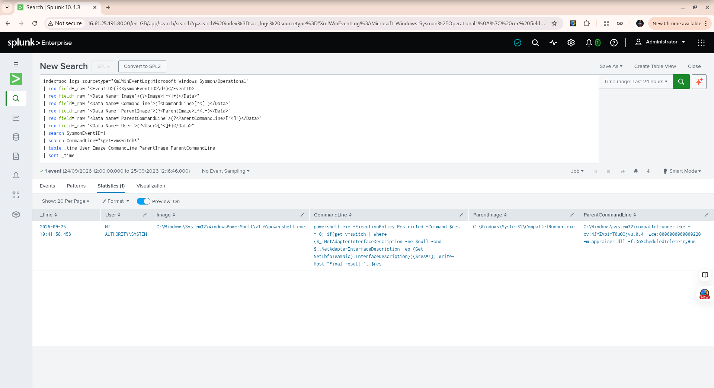

# Week 9 — Incident Response Exercise 03: PowerShell Compatibility Telemetry

## Overview

This incident response exercise investigated a PowerShell process creation event identified in Sysmon telemetry.

The investigation followed the SOC incident-response workflow:

**Alert → Validate → Scope → Investigate → Contain → Document → Close**

The objective was to determine whether the PowerShell execution represented suspicious activity or expected Windows system activity.

---

## Incident Summary

| Field               | Value                                                       |
| ------------------- | ----------------------------------------------------------- |
| Investigation Date  | 2026-09-25                                                  |
| Event Time          | 2026-09-25 10:41:58.453                                     |
| Sysmon Event ID     | 1 — Process Creation                                        |
| User                | `NT AUTHORITY\SYSTEM`                                       |
| Process             | `C:\Windows\System32\WindowsPowerShell\v1.0\powershell.exe` |
| Process ID          | `5524`                                                      |
| Process GUID        | `{12dcad69-4ff6-6ab6-ac01-000000006b00}`                    |
| Parent Process      | `C:\Windows\System32\CompatTelRunner.exe`                   |
| Parent Activity     | `appraiser.dll -f:DoScheduledTelemetryRun`                  |
| Initial Disposition | Benign / Expected Windows System Activity                   |

---

## 1. Initial Validation

The investigation began by reviewing Sysmon Event ID 1 process creation events and excluding known Splunk Universal Forwarder processes.

A small number of Windows PowerShell processes remained for investigation.

One event occurred at:

`2026-09-25 10:41:58.453`

The process was:

`C:\Windows\System32\WindowsPowerShell\v1.0\powershell.exe`

The process ran as:

`NT AUTHORITY\SYSTEM`

The command line was:

```text
powershell.exe -ExecutionPolicy Restricted -Command $res = 0; if(get-vmswitch | Where {$_.NetAdapterInterfaceDescription -ne $null -and $_.NetAdapterInterfaceDescription -eq (Get-NetLbfoTeamNic).InterfaceDescription}){$res=1}; Write-Host "Final result:", $res
```

The command performed checks involving the Windows virtual switch and network adapter configuration.

---

## 2. Parent Process Investigation

The parent process was identified as:

```text
C:\Windows\System32\CompatTelRunner.exe
```

The parent command line was:

```text
C:\Windows\system32\compattelrunner.exe -cv:4JMZVpimT0uOOjvu.0.4 -wce:0000000000000220 -m:appraiser.dll -f:DoScheduledTelemetryRun
```

Additional CompatTelRunner activity observed around the same time included Windows inventory and telemetry functions such as:

* `CreateDeviceInventory`
* `UpdateSoftwareInventoryW`
* `RunGeneralTelemetry`
* `DoScheduledTelemetryRun`
* `RunUpdate`
* `BackupMareData`

This provided additional context for the PowerShell execution.

The observed process relationship was:

```text
svchost.exe
    |
    └── CompatTelRunner.exe
            |
            └── powershell.exe
```

---

## 3. Process GUID Correlation

The PowerShell process was tracked using its unique Process GUID:

```text
{12dcad69-4ff6-6ab6-ac01-000000006b00}
```

A search for this exact Process GUID returned one Sysmon event:

```text
2026-09-25 10:41:58.453
Event ID: 1
Image: powershell.exe
```

No additional Sysmon network connection event (Event ID 3) was associated with this exact Process GUID.

This was important because the investigation used the specific process instance rather than relying only on the process name or PID.

---

## 4. Network Activity Check

The exact PowerShell Process GUID was correlated against Sysmon Event ID 3 network activity.

Result:

**No associated network connection was found.**

The destination fields were empty:

* Destination IP: none
* Destination hostname: none
* Destination port: none

Therefore, the investigated PowerShell process did not show an associated outbound network connection in the available telemetry.

---

## 5. Suspicious PowerShell Indicator Check

The command line was checked for several indicators commonly investigated during PowerShell analysis.

| Indicator                | Result     |
| ------------------------ | ---------- |
| Encoded command          | No         |
| `ExecutionPolicy Bypass` | No         |
| Hidden window            | No         |
| Network connection       | None found |

The process used:

```text
-ExecutionPolicy Restricted
```

rather than an execution-policy bypass.

---

## 6. Command-Line Correlation

A search for PowerShell commands containing:

```text
get-vmswitch
```

returned the same event.

The event was associated with:

```text
CompatTelRunner.exe
```

and:

```text
-m:appraiser.dll -f:DoScheduledTelemetryRun
```

This provided additional context linking the PowerShell command to the Windows compatibility and telemetry process.

---

## 7. Investigation Findings

The investigation established the following:

1. The PowerShell process was executed as `NT AUTHORITY\SYSTEM`.
2. The parent process was `CompatTelRunner.exe`.
3. The parent process was performing a scheduled telemetry operation.
4. The PowerShell command performed Windows virtual-switch and network-adapter checks.
5. The process used `-ExecutionPolicy Restricted`.
6. No encoded PowerShell command indicator was identified.
7. No `ExecutionPolicy Bypass` indicator was identified.
8. No hidden-window indicator was identified.
9. No Sysmon Event ID 3 network connection was associated with the exact Process GUID.
10. No evidence identified during this investigation required containment or escalation.

---

## 8. Containment Decision

No containment action was performed.

The evidence did not establish malicious activity associated with the investigated process.

The process was therefore not isolated, terminated, or blocked.

This decision applies specifically to the investigated event and does not mean that PowerShell activity should automatically be considered safe in other investigations.

---

## 9. Final Disposition

**Disposition: Benign / Expected Windows System Activity**

The investigated PowerShell execution was consistent with Windows compatibility and telemetry activity based on the observed process hierarchy, command line, execution policy, and absence of suspicious network or PowerShell execution indicators.

No evidence from this investigation justified escalation as a security incident.

---

## 10. Analyst Lessons Learned

This investigation demonstrated several important SOC analyst techniques:

### Process hierarchy matters

A PowerShell process should not automatically be treated as malicious.

The analyst should investigate:

```text
Child Process → Parent Process → Parent Activity
```

### Process GUID is stronger than PID alone

PIDs can be reused by Windows.

The Process GUID allowed the investigation to focus on the exact PowerShell process instance.

### PowerShell requires context

PowerShell is a legitimate Windows administrative and automation tool.

Suspicion should be based on evidence such as command-line behavior, parent process, execution policy, network activity, encoded commands, persistence indicators, and other contextual evidence.

### Negative findings are valuable

The absence of:

* encoded commands,
* execution-policy bypass,
* hidden-window execution, and
* network activity

helped establish the final disposition.

### Incident response is evidence-driven

The investigation did not stop at identifying a PowerShell process.

The process was validated, scoped, correlated with its parent, checked for network activity, checked for suspicious execution indicators, and then documented before closure.

---

## 11. Evidence

The investigation evidence screenshot is stored at:

```text
media/week9-incident-response-03-powershell-compatibility.png
```



---

## 12. Final Status

**Exercise 03: COMPLETE**

The PowerShell process was investigated using Sysmon and Splunk telemetry.

The available evidence supported a disposition of:

**Benign / Expected Windows System Activity**

No containment or escalation was required.
